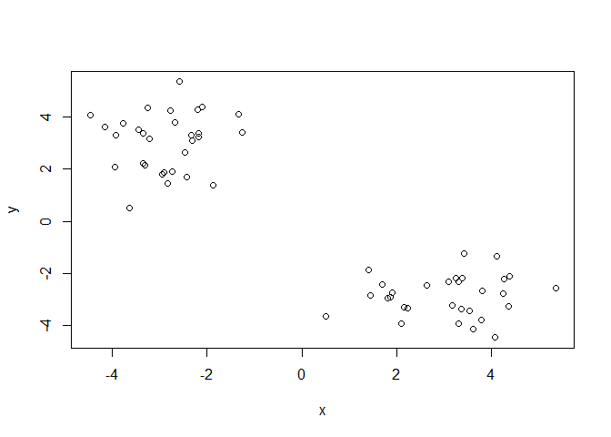
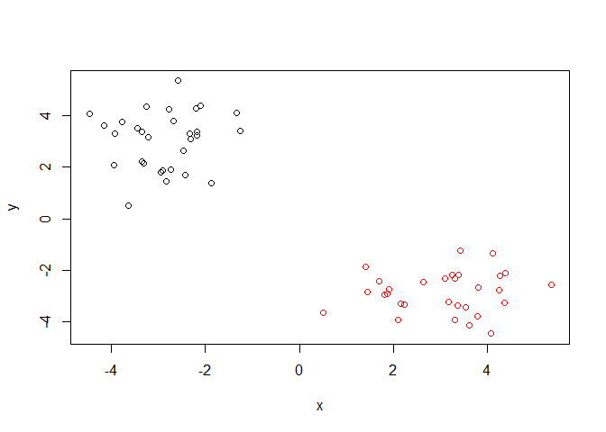
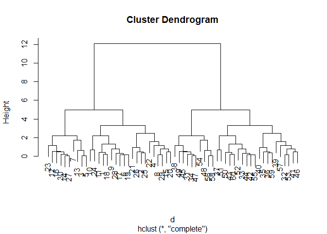
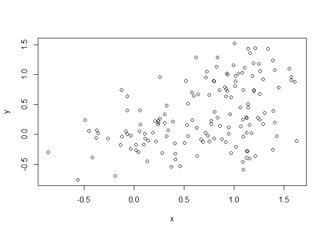
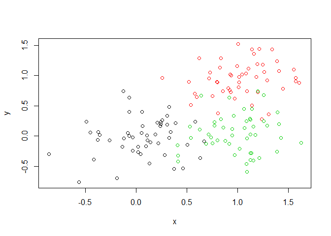
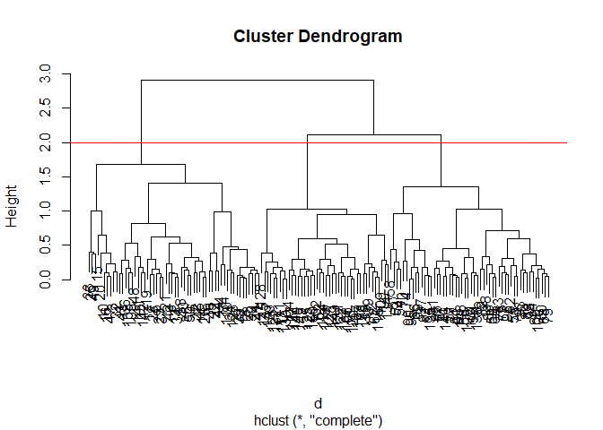
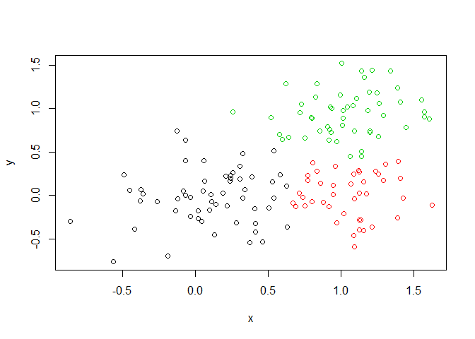

class08
================
Benjamin Cho
April 25, 2019

K-means clustering
------------------

Start with an example of running **kmeans()** function

``` r
tmp <- c(rnorm(30,-3), rnorm(30,3))
x <- cbind(x=tmp, y=rev(tmp))
plot(x)
```



Use the kmeans() function setting k to 2 and nstart=20 Inspect/print the results Q. How many points are in each cluster? 30 Q. What ‘component’ of your result object details - cluster size?

-   cluster assignment/membership?
-   cluster center? Plot x colored by the kmeans cluster assignment and add cluster centers as blue points

``` r
y <- kmeans(x, centers=2, nstart=20)
y
```

    ## K-means clustering with 2 clusters of sizes 30, 30
    ## 
    ## Cluster means:
    ##           x         y
    ## 1 -2.863447  3.054202
    ## 2  3.054202 -2.863447
    ## 
    ## Clustering vector:
    ##  [1] 1 1 1 1 1 1 1 1 1 1 1 1 1 1 1 1 1 1 1 1 1 1 1 1 1 1 1 1 1 1 2 2 2 2 2
    ## [36] 2 2 2 2 2 2 2 2 2 2 2 2 2 2 2 2 2 2 2 2 2 2 2 2 2
    ## 
    ## Within cluster sum of squares by cluster:
    ## [1] 54.78644 54.78644
    ##  (between_SS / total_SS =  90.6 %)
    ## 
    ## Available components:
    ## 
    ## [1] "cluster"      "centers"      "totss"        "withinss"    
    ## [5] "tot.withinss" "betweenss"    "size"         "iter"        
    ## [9] "ifault"

``` r
y$size
```

    ## [1] 30 30

``` r
y$cluster
```

    ##  [1] 1 1 1 1 1 1 1 1 1 1 1 1 1 1 1 1 1 1 1 1 1 1 1 1 1 1 1 1 1 1 2 2 2 2 2
    ## [36] 2 2 2 2 2 2 2 2 2 2 2 2 2 2 2 2 2 2 2 2 2 2 2 2 2

``` r
#plotting with color by the clustering
plot(x,col=y$cluster)
```



\#\# heirarchical Clustering example

We must give the **hclust()** function a distance matrix not the raw data as input

``` r
#distance matrix calculation
d <- dist(x)
d
```

    ##              1           2           3           4           5           6
    ## 2   0.56105116                                                            
    ## 3   1.14156867  1.22654432                                                
    ## 4   0.99981297  1.23817439  2.13830779                                    
    ## 5   1.21197267  1.30356407  0.07707866  2.20686260                        
    ## 6   1.18224059  1.74180805  1.64379171  1.46385023  1.67074526            
    ## 7   2.87872900  2.82188091  1.74862375  3.87853882  1.68625580  3.23065941
    ## 8   1.61101377  2.10357847  2.48411963  1.15963599  2.52862220  0.99832857
    ## 9   1.15852803  1.60414670  0.97044662  1.90664259  0.97249508  0.80321262
    ## 10  2.10584967  2.66563105  2.40841470  2.21996868  2.41534041  0.92382303
    ## 11  0.24271918  0.70726154  0.94663270  1.19839070  1.01230275  1.07060666
    ## 12  1.90951717  2.19240014  1.05445381  2.79164740  0.99184934  1.70386550
    ## 13  1.40011617  1.21818955  0.60818689  2.36795202  0.62983654  2.18317805
    ## 14  1.57478313  1.76896462  0.57176662  2.52905341  0.50270039  1.68908027
    ## 15  1.06379719  1.48323120  2.10879888  0.50141006  2.16738393  1.05819989
    ## 16  1.98985530  2.15363640  0.92929162  2.94673689  0.85293869  2.04549441
    ## 17  1.02922871  1.58589213  1.48517812  1.40544590  1.51507542  0.17000952
    ## 18  0.18404546  0.51956587  1.30760052  0.85270817  1.37980378  1.27759478
    ## 19  1.17902961  1.73188016  1.54061461  1.55475140  1.56329939  0.14105994
    ## 20  0.81536041  1.34042963  1.71736232  0.81325319  1.76929066  0.65099022
    ## 21  1.31440005  0.93972060  2.16089590  1.23952874  2.23758820  2.39337558
    ## 22  2.13567095  2.44417199  3.22168537  1.20676615  3.28170115  2.01240884
    ## 23  2.47154712  2.80555010  1.69672007  3.27715243  1.63448674  2.00691533
    ## 24  2.16105765  2.70811988  2.75997628  1.94970521  2.78428017  1.11775375
    ## 25  0.83633713  0.39135953  1.61357121  1.16014874  1.69040511  1.99346129
    ## 26  0.58560176  0.48771557  1.61085581  0.77772707  1.68682683  1.64797248
    ## 27  1.61187635  1.78706233  0.57506565  2.57358127  0.50229880  1.75345868
    ## 28  1.08441512  1.62343439  1.36006578  1.58075388  1.38170036  0.30672129
    ## 29  1.46239375  1.95976201  2.33843130  1.06040548  2.38391169  0.88729758
    ## 30  1.58804071  1.83331685  0.68418757  2.51316855  0.62390251  1.58187409
    ## 31  8.06352745  8.39776876  7.22733167  8.78499485  7.15547754  7.35882357
    ## 32  9.44773779  9.87227012  8.81072002  9.99506449  8.74716351  8.53145778
    ## 33  8.60064721  8.99231815  7.88317288  9.22133540  7.81612790  7.76230053
    ## 34  8.16153119  8.48421180  7.30416284  8.89942787  7.23150537  7.48168724
    ## 35 10.09808244 10.46176124  9.31511482 10.76242428  9.24497795  9.31145988
    ## 36 10.26262657 10.61041006  9.44773725 10.95285744  9.37633167  9.50975345
    ## 37  8.82480526  9.27376556  8.26155094  9.31678778  8.20181713  7.85805053
    ## 38  7.07149630  7.41914500  6.26404026  7.77882839  6.19357700  6.34865324
    ## 39 10.54735260 10.98267189  9.93702899 11.06413166  9.87447881  9.60294930
    ## 40 10.79911575 11.15115390  9.99164720 11.48045900  9.92045664 10.03384671
    ## 41  9.36982603  9.76862568  8.66696113  9.97230842  8.60037572  8.51049966
    ## 42  8.62616779  9.02596043  7.92810773  9.23077169  7.86193256  7.76952207
    ## 43  9.68880729 10.05535528  8.91261372 10.34991321  8.84281746  8.89845859
    ## 44  8.77283952  9.16959228  8.06689928  9.38262159  8.00032575  7.92192070
    ## 45  7.84946968  8.16053138  6.97263619  8.60531035  6.89934473  7.19936651
    ## 46  9.78248495 10.18923999  9.09798988 10.36669659  9.03213960  8.90338565
    ## 47  8.16048136  8.48681935  7.30963227  8.89309827  7.23721233  7.47245230
    ## 48  9.11623240  9.41718701  8.22075459  9.87971564  8.14666751  8.47503659
    ## 49  7.69485818  8.03223151  6.86547827  8.41378130  6.79396708  6.98732586
    ## 50  9.27482379  9.63728100  8.49103845  9.94486791  8.42100758  8.49634752
    ## 51  8.20413565  8.64116003  7.60769188  8.73001366  7.54652605  7.26725634
    ## 52  8.36023379  8.73149787  7.59745428  9.01986150  7.52849494  7.56949041
    ## 53  9.47585894  9.90591239  8.85402818 10.01034859  8.79119172  8.54736410
    ## 54  8.00258369  8.23874787  7.01695878  8.84627260  6.94059734  7.51754474
    ## 55  8.72801834  9.13201541  8.03997381  9.32352735  7.97422822  7.86129955
    ## 56  8.66231440  8.98636369  7.80638882  9.39570955  7.73369919  7.97422822
    ## 57 10.17808315 10.57265792  9.46300673 10.78515125  9.39570955  9.32352735
    ## 58  8.73224506  9.05787458  7.87899346  9.46300673  7.80638882  8.03997381
    ## 59  9.87691734 10.22220431  9.05787458 10.57265792  8.98636369  9.13201541
    ## 60  9.51249993  9.87691734  8.73224506 10.17808315  8.66231440  8.72801834
    ##              7           8           9          10          11          12
    ## 2                                                                         
    ## 3                                                                         
    ## 4                                                                         
    ## 5                                                                         
    ## 6                                                                         
    ## 7                                                                         
    ## 8   4.16902848                                                            
    ## 9   2.43334365  1.78252353                                                
    ## 10  3.77009062  1.28074734  1.44412438                                    
    ## 11  2.69468756  1.65157289  0.92934042  1.98783430                        
    ## 12  1.69978683  2.70028214  0.93487389  2.08737241  1.66763181            
    ## 13  1.61791880  2.93019241  1.57029786  2.99506153  1.28772631  1.55705489
    ## 14  1.54256809  2.64365531  0.89093731  2.27374164  1.34421222  0.50079741
    ## 15  3.85223972  0.68066321  1.65321258  1.73462794  1.18059273  2.58088502
    ## 16  1.23923656  3.02174621  1.24312956  2.53117761  1.76106723  0.47736652
    ## 17  3.09911764  1.09061396  0.69197083  1.08300640  0.90575299  1.61669856
    ## 18  3.03338258  1.58728333  1.33051747  2.19482225  0.42632011  2.09354449
    ## 19  3.10125076  1.13938804  0.66952164  0.94987967  1.04128204  1.56330625
    ## 20  3.44249062  0.80568982  1.19178024  1.46898330  0.84683699  2.12139670
    ## 21  3.66385033  2.38417829  2.46833430  3.28026845  1.53910286  3.12764908
    ## 22  4.96747202  1.08479029  2.72486953  2.34321835  2.28370733  3.65972118
    ## 23  1.99187932  2.98767839  1.37068001  2.11020116  2.22941552  0.64263754
    ## 24  4.28598753  0.81836855  1.86426598  0.69600284  2.11841656  2.65417297
    ## 25  3.16063314  2.18681687  1.95997975  2.90907535  1.03652632  2.58248228
    ## 26  3.27816899  1.77667201  1.74258478  2.54801469  0.82454417  2.47666574
    ## 27  1.47757385  2.70511312  0.95638548  2.33986469  1.38424694  0.52892274
    ## 28  2.92411650  1.28947545  0.49780037  1.09948186  0.92021331  1.41239791
    ## 29  4.03008782  0.15010284  1.65690212  1.27667934  1.50148369  2.58115344
    ## 30  1.66597874  2.55414691  0.77866167  2.12374080  1.35017226  0.37149910
    ## 31  6.42527846  8.17001454  6.92486725  6.92358089  7.82283549  6.20610356
    ## 32  8.36191319  9.16378796  8.29133670  7.88441591  9.22061356  7.75626945
    ## 33  7.30776598  8.47409565  7.44283016  7.19645001  8.36674058  6.83339318
    ## 34  6.45172091  8.30673778  7.02915348  7.06770993  7.92010635  6.29182453
    ## 35  8.56533866 10.05428211  8.94582833  8.78102859  9.86037465  8.27885718
    ## 36  8.62860459 10.27613810  9.11595984  9.00871298 10.02324933  8.42099301
    ## 37  7.96720986  8.43884705  7.67693979  7.16593404  8.60432997  7.21095852
    ## 38  5.56912747  7.15731407  5.92743534  5.91220047  6.83176520  5.23149725
    ## 39  9.50844011 10.19716022  9.39400795  8.92292809 10.32311968  8.88282512
    ## 40  9.17690873 10.78882702  9.65054943  9.51793369 10.56019158  8.96287936
    ## 41  8.09539708  9.19831557  8.21140018  7.91816568  9.13726895  7.61593057
    ## 42  7.38983593  8.46540239  7.46773030  7.18602643  8.39369010  6.87624758
    ## 43  8.18661636  9.64082824  8.53584121  8.36774563  9.45140651  7.87435727
    ## 44  7.50817286  8.62161036  7.61455564  7.34252090  8.53983394  7.01589171
    ## 45  6.08767680  8.04292538  6.72481819  6.81665978  7.60745586  5.96918133
    ## 46  8.55023388  9.57022584  8.62401284  8.28947903  9.55149508  8.04546394
    ## 47  6.47172837  8.29280177  7.02599898  7.05107671  7.91927184  6.29445441
    ## 48  7.25366428  9.31558185  7.99622785  8.08408078  8.87392203  7.22857585
    ## 49  6.09307618  7.79969077  6.55502973  6.55476026  7.45435835  5.84121808
    ## 50  7.76066998  9.25011182  8.12327269  7.98004896  9.03689296  7.45435835
    ## 51  7.27689051  7.88839631  7.05101299  6.60953897  7.98004896  6.55476026
    ## 52  6.93968896  8.32078353  7.20644650  7.05101299  8.12327269  6.55502973
    ## 53  8.43251034  9.16652173  8.32078353  7.88839631  9.25011182  7.79969077
    ## 54  5.86115800  8.43251034  6.93968896  7.27689051  7.76066998  6.09307618
    ## 55  7.51754474  8.54736410  7.56949041  7.26725634  8.49634752  6.98732586
    ## 56  6.94059734  8.79119172  7.52849494  7.54652605  8.42100758  6.79396708
    ## 57  8.84627260 10.01034859  9.01986150  8.73001366  9.94486791  8.41378130
    ## 58  7.01695878  8.85402818  7.59745428  7.60769188  8.49103845  6.86547827
    ## 59  8.23874787  9.90591239  8.73149787  8.64116003  9.63728100  8.03223151
    ## 60  8.00258369  9.47585894  8.36023379  8.20413565  9.27482379  7.69485818
    ##             13          14          15          16          17          18
    ## 2                                                                         
    ## 3                                                                         
    ## 4                                                                         
    ## 5                                                                         
    ## 6                                                                         
    ## 7                                                                         
    ## 8                                                                         
    ## 9                                                                         
    ## 10                                                                        
    ## 11                                                                        
    ## 12                                                                        
    ## 13                                                                        
    ## 14  1.05813129                                                            
    ## 15  2.45661110  2.40057775                                                
    ## 16  1.27567840  0.41776851  2.80984966                                    
    ## 17  2.01686484  1.56205327  1.04324934  1.93222738                        
    ## 18  1.51886770  1.75552357  0.98942561  2.16956349  1.13581171            
    ## 19  2.09489262  1.55878468  1.17208484  1.90950262  0.16050800  1.29174654
    ## 20  2.13053794  1.96077960  0.46182987  2.36473421  0.60006296  0.82221854
    ## 21  2.04860474  2.70857143  1.70477755  3.08990284  2.26872732  1.15761931
    ## 22  3.53465657  3.51114646  1.11628302  3.91657123  2.05802587  2.02144398
    ## 23  2.18820171  1.14011415  2.99762849  0.97677969  1.96771695  2.65345102
    ## 24  3.29857965  2.74985351  1.45077523  3.06257449  1.28198508  2.19432394
    ## 25  1.54346401  2.15995261  1.52086228  2.54212749  1.85076957  0.71590143
    ## 26  1.69278762  2.10692468  1.11075151  2.51275426  1.51880031  0.41353427
    ## 27  1.02897414  0.06650403  2.45385478  0.37824210  1.62515351  1.79136926
    ## 28  1.91981574  1.38237351  1.24251599  1.74089419  0.20815528  1.21573900
    ## 29  2.78062580  2.50937336  0.56650759  2.89192622  0.96576198  1.44225091
    ## 30  1.21216855  0.17161924  2.35164905  0.46795045  1.46523906  1.77138443
    ## 31  7.58388835  6.65671028  8.41696275  6.32773783  7.38731210  8.24325251
    ## 32  9.26597630  8.24773853  9.55866469  7.99205260  8.60303370  9.61394887
    ## 33  8.30453009  7.31360109  8.81018894  7.02940352  7.81702106  8.77321874
    ## 34  7.64606743  6.73493657  8.53923155  6.39757054  7.50575983  8.34220155
    ## 35  9.69543068  8.74335127 10.36541554  8.43012014  9.35709636 10.27440680
    ## 36  9.80830008  8.87657561 10.56644235  8.55119040  9.54908599 10.44076262
    ## 37  8.74811274  7.70917000  8.86626936  7.48488947  7.94049360  8.98518216
    ## 38  6.64481725  5.69233784  7.40685277  5.37806786  6.37920752  7.25011602
    ## 39 10.40022759  9.37648206 10.61787507  9.12769150  9.68122376 10.71089096
    ## 40 10.35509641  9.42030000 11.08950019  9.09682888 10.07584125 10.97673556
    ## 41  9.09244247  8.09804480  9.55345203  7.81706624  8.57006446  9.54106525
    ## 42  8.35884599  7.35984896  8.81391007  7.08319627  7.82798786  8.79737403
    ## 43  9.29826697  8.34086311  9.95222578  8.03100581  8.94453805  9.86482152
    ## 44  8.49320855  7.49800612  8.96728750  7.21773681  7.97933267  8.94453805
    ## 45  7.30270647  6.40505803  8.25518181  6.06093567  7.21773681  8.03100581
    ## 46  9.53084476  8.53026778  9.94116667  8.25518181  8.96728750  9.95222578
    ## 47  7.65596726  6.73992270  8.53026778  6.40505803  7.49800612  8.34086311
    ## 48  8.53039352  7.65596726  9.53084476  7.30270647  8.49320855  9.29826697
    ## 49  7.22857585  6.29445441  8.04546394  5.96918133  7.01589171  7.87435727
    ## 50  8.87392203  7.91927184  9.55149508  7.60745586  8.53983394  9.45140651
    ## 51  8.08408078  7.05107671  8.28947903  6.81665978  7.34252090  8.36774563
    ## 52  7.99622785  7.02599898  8.62401284  6.72481819  7.61455564  8.53584121
    ## 53  9.31558185  8.29280177  9.57022584  8.04292538  8.62161036  9.64082824
    ## 54  7.25366428  6.47172837  8.55023388  6.08767680  7.50817286  8.18661636
    ## 55  8.47503659  7.47245230  8.90338565  7.19936651  7.92192070  8.89845859
    ## 56  8.14666751  7.23721233  9.03213960  6.89934473  8.00032575  8.84281746
    ## 57  9.87971564  8.89309827 10.36669659  8.60531035  9.38262159 10.34991321
    ## 58  8.22075459  7.30963227  9.09798988  6.97263619  8.06689928  8.91261372
    ## 59  9.41718701  8.48681935 10.18923999  8.16053138  9.16959228 10.05535528
    ## 60  9.11623240  8.16048136  9.78248495  7.84946968  8.77283952  9.68880729
    ##             19          20          21          22          23          24
    ## 2                                                                         
    ## 3                                                                         
    ## 4                                                                         
    ## 5                                                                         
    ## 6                                                                         
    ## 7                                                                         
    ## 8                                                                         
    ## 9                                                                         
    ## 10                                                                        
    ## 11                                                                        
    ## 12                                                                        
    ## 13                                                                        
    ## 14                                                                        
    ## 15                                                                        
    ## 16                                                                        
    ## 17                                                                        
    ## 18                                                                        
    ## 19                                                                        
    ## 20  0.74369309                                                            
    ## 21  2.42837513  1.81697089                                                
    ## 22  2.14869263  1.55188051  2.28610371                                    
    ## 23  1.86974188  2.53775965  3.73200980  4.01839894                        
    ## 24  1.22121944  1.37565866  3.13869969  1.75971443  2.76395427            
    ## 25  2.00548302  1.49600813  0.54864104  2.34519496  3.19222245  2.86801043
    ## 26  1.67795427  1.10557515  0.75192232  1.98142705  3.05225441  2.46902113
    ## 27  1.62367887  2.01656209  2.72584299  3.56582096  1.16093799  2.81606633
    ## 28  0.18231650  0.79017723  2.36834276  2.26618073  1.76131851  1.40327799
    ## 29  1.02769209  0.65563155  2.26974711  1.14653053  2.88960995  0.89119477
    ## 30  1.44748271  1.90240697  2.77155367  3.45403165  1.01274547  2.62001102
    ## 31  7.24773000  7.98735606  9.32934771  9.25292430  5.59866718  7.57809715
    ## 32  8.44749380  9.18243652 10.75967095 10.19955691  7.11436561  8.44260938
    ## 33  7.66659191  8.40936733  9.90141152  9.53737803  6.19812507  7.80144229
    ## 34  7.36833368  8.10573124  9.41847043  9.39074998  5.69224002  7.72774678
    ## 35  9.21012316  9.95380707 11.38437968 11.12414275  7.65626269  9.39767020
    ## 36  9.40471290 10.14773866 11.53866816 11.35121299  7.80670842  9.63678440
    ## 37  7.78248752  8.50776526 10.13919416  9.45558899  6.56915122  7.69587576
    ## 38  6.23857621  6.97913311  8.34656185  8.24032745  4.61471906  6.56915122
    ## 39  9.52411315 10.25347789 11.86112103 11.21530167  8.24032745  9.45558899
    ## 40  9.93036795 10.67379469 12.07813449 11.86112103  8.34656185 10.13919416
    ## 41  8.41803256  9.15940371 10.67379469 10.25347789  6.97913311  8.50776526
    ## 42  7.67628493  8.41803256  9.93036795  9.52411315  6.23857621  7.78248752
    ## 43  8.79737403  9.54106525 10.97673556 10.71089096  7.25011602  8.98518216
    ## 44  7.82798786  8.57006446 10.07584125  9.68122376  6.37920752  7.94049360
    ## 45  7.08319627  7.81706624  9.09682888  9.12769150  5.37806786  7.48488947
    ## 46  8.81391007  9.55345203 11.08950019 10.61787507  7.40685277  8.86626936
    ## 47  7.35984896  8.09804480  9.42030000  9.37648206  5.69233784  7.70917000
    ## 48  8.35884599  9.09244247 10.35509641 10.40022759  6.64481725  8.74811274
    ## 49  6.87624758  7.61593057  8.96287936  8.88282512  5.23149725  7.21095852
    ## 50  8.39369010  9.13726895 10.56019158 10.32311968  6.83176520  8.60432997
    ## 51  7.18602643  7.91816568  9.51793369  8.92292809  5.91220047  7.16593404
    ## 52  7.46773030  8.21140018  9.65054943  9.39400795  5.92743534  7.67693979
    ## 53  8.46540239  9.19831557 10.78882702 10.19716022  7.15731407  8.43884705
    ## 54  7.38983593  8.09539708  9.17690873  9.50844011  5.56912747  7.96720986
    ## 55  7.76952207  8.51049966 10.03384671  9.60294930  6.34865324  7.85805053
    ## 56  7.86193256  8.60037572  9.92045664  9.87447881  6.19357700  8.20181713
    ## 57  9.23077169  9.97230842 11.48045900 11.06413166  7.77882839  9.31678778
    ## 58  7.92810773  8.66696113  9.99164720  9.93702899  6.26404026  8.26155094
    ## 59  9.02596043  9.76862568 11.15115390 10.98267189  7.41914500  9.27376556
    ## 60  8.62616779  9.36982603 10.79911575 10.54735260  7.07149630  8.82480526
    ##             25          26          27          28          29          30
    ## 2                                                                         
    ## 3                                                                         
    ## 4                                                                         
    ## 5                                                                         
    ## 6                                                                         
    ## 7                                                                         
    ## 8                                                                         
    ## 9                                                                         
    ## 10                                                                        
    ## 11                                                                        
    ## 12                                                                        
    ## 13                                                                        
    ## 14                                                                        
    ## 15                                                                        
    ## 16                                                                        
    ## 17                                                                        
    ## 18                                                                        
    ## 19                                                                        
    ## 20                                                                        
    ## 21                                                                        
    ## 22                                                                        
    ## 23                                                                        
    ## 24                                                                        
    ## 25                                                                        
    ## 26  0.41052511                                                            
    ## 27  2.17728552  2.13609647                                                
    ## 28  1.91981058  1.61662504  1.44680098                                    
    ## 29  2.05329695  1.64406997  2.57016381  1.16876058                        
    ## 30  2.22441556  2.14054547  0.22967327  1.27617147  2.42400439            
    ## 31  8.78686850  8.64726876  6.65321591  7.20466926  8.12706601  6.57015527
    ## 32 10.24430163 10.02747858  8.26054901  8.45298214  9.15859705  8.12706601
    ## 33  9.37292007  9.18537261  7.32050070  7.65258101  8.45298214  7.20466926
    ## 34  8.87422764  8.74393827  6.72929792  7.32050070  8.26054901  6.65321591
    ## 35 10.84764774 10.68366258  8.74393827  9.18537261 10.02747858  8.64726876
    ## 36 10.99837529 10.84764774  8.87422764  9.37292007 10.24430163  8.78686850
    ## 37  9.63678440  9.39767020  7.72774678  7.80144229  8.44260938  7.57809715
    ## 38  7.80670842  7.65626269  5.69224002  6.19812507  7.11436561  5.59866718
    ## 39 11.35121299 11.12414275  9.39074998  9.53737803 10.19955691  9.25292430
    ## 40 11.53866816 11.38437968  9.41847043  9.90141152 10.75967095  9.32934771
    ## 41 10.14773866  9.95380707  8.10573124  8.40936733  9.18243652  7.98735606
    ## 42  9.40471290  9.21012316  7.36833368  7.66659191  8.44749380  7.24773000
    ## 43 10.44076262 10.27440680  8.34220155  8.77321874  9.61394887  8.24325251
    ## 44  9.54908599  9.35709636  7.50575983  7.81702106  8.60303370  7.38731210
    ## 45  8.55119040  8.43012014  6.39757054  7.02940352  7.99205260  6.32773783
    ## 46 10.56644235 10.36541554  8.53923155  8.81018894  9.55866469  8.41696275
    ## 47  8.87657561  8.74335127  6.73493657  7.31360109  8.24773853  6.65671028
    ## 48  9.80830008  9.69543068  7.64606743  8.30453009  9.26597630  7.58388835
    ## 49  8.42099301  8.27885718  6.29182453  6.83339318  7.75626945  6.20610356
    ## 50 10.02324933  9.86037465  7.92010635  8.36674058  9.22061356  7.82283549
    ## 51  9.00871298  8.78102859  7.06770993  7.19645001  7.88441591  6.92358089
    ## 52  9.11595984  8.94582833  7.02915348  7.44283016  8.29133670  6.92486725
    ## 53 10.27613810 10.05428211  8.30673778  8.47409565  9.16378796  8.17001454
    ## 54  8.62860459  8.56533866  6.45172091  7.30776598  8.36191319  6.42527846
    ## 55  9.50975345  9.31145988  7.48168724  7.76230053  8.53145778  7.35882357
    ## 56  9.37633167  9.24497795  7.23150537  7.81612790  8.74716351  7.15547754
    ## 57 10.95285744 10.76242428  8.89942787  9.22133540  9.99506449  8.78499485
    ## 58  9.44773725  9.31511482  7.30416284  7.88317288  8.81072002  7.22733167
    ## 59 10.61041006 10.46176124  8.48421180  8.99231815  9.87227012  8.39776876
    ## 60 10.26262657 10.09808244  8.16153119  8.60064721  9.44773779  8.06352745
    ##             31          32          33          34          35          36
    ## 2                                                                         
    ## 3                                                                         
    ## 4                                                                         
    ## 5                                                                         
    ## 6                                                                         
    ## 7                                                                         
    ## 8                                                                         
    ## 9                                                                         
    ## 10                                                                        
    ## 11                                                                        
    ## 12                                                                        
    ## 13                                                                        
    ## 14                                                                        
    ## 15                                                                        
    ## 16                                                                        
    ## 17                                                                        
    ## 18                                                                        
    ## 19                                                                        
    ## 20                                                                        
    ## 21                                                                        
    ## 22                                                                        
    ## 23                                                                        
    ## 24                                                                        
    ## 25                                                                        
    ## 26                                                                        
    ## 27                                                                        
    ## 28                                                                        
    ## 29                                                                        
    ## 30                                                                        
    ## 31                                                                        
    ## 32  2.42400439                                                            
    ## 33  1.27617147  1.16876058                                                
    ## 34  0.22967327  2.57016381  1.44680098                                    
    ## 35  2.14054547  1.64406997  1.61662504  2.13609647                        
    ## 36  2.22441556  2.05329695  1.91981058  2.17728552  0.41052511            
    ## 37  2.62001102  0.89119477  1.40327799  2.81606633  2.46902113  2.86801043
    ## 38  1.01274547  2.88960995  1.76131851  1.16093799  3.05225441  3.19222245
    ## 39  3.45403165  1.14653053  2.26618073  3.56582096  1.98142705  2.34519496
    ## 40  2.77155367  2.26974711  2.36834276  2.72584299  0.75192232  0.54864104
    ## 41  1.90240697  0.65563155  0.79017723  2.01656209  1.10557515  1.49600813
    ## 42  1.44748271  1.02769209  0.18231650  1.62367887  1.67795427  2.00548302
    ## 43  1.77138443  1.44225091  1.21573900  1.79136926  0.41353427  0.71590143
    ## 44  1.46523906  0.96576198  0.20815528  1.62515351  1.51880031  1.85076957
    ## 45  0.46795045  2.89192622  1.74089419  0.37824210  2.51275426  2.54212749
    ## 46  2.35164905  0.56650759  1.24251599  2.45385478  1.11075151  1.52086228
    ## 47  0.17161924  2.50937336  1.38237351  0.06650403  2.10692468  2.15995261
    ## 48  1.21216855  2.78062580  1.91981574  1.02897414  1.69278762  1.54346401
    ## 49  0.37149910  2.58115344  1.41239791  0.52892274  2.47666574  2.58248228
    ## 50  1.35017226  1.50148369  0.92021331  1.38424694  0.82454417  1.03652632
    ## 51  2.12374080  1.27667934  1.09948186  2.33986469  2.54801469  2.90907535
    ## 52  0.77866167  1.65690212  0.49780037  0.95638548  1.74258478  1.95997975
    ## 53  2.55414691  0.15010284  1.28947545  2.70511312  1.77667201  2.18681687
    ## 54  1.66597874  4.03008782  2.92411650  1.47757385  3.27816899  3.16063314
    ## 55  1.58187409  0.88729758  0.30672129  1.75345868  1.64797248  1.99346129
    ## 56  0.62390251  2.38391169  1.38170036  0.50229880  1.68682683  1.69040511
    ## 57  2.51316855  1.06040548  1.58075388  2.57358127  0.77772707  1.16014874
    ## 58  0.68418757  2.33843130  1.36006578  0.57506565  1.61085581  1.61357121
    ## 59  1.83331685  1.95976201  1.62343439  1.78706233  0.48771557  0.39135953
    ## 60  1.58804071  1.46239375  1.08441512  1.61187635  0.58560176  0.83633713
    ##             37          38          39          40          41          42
    ## 2                                                                         
    ## 3                                                                         
    ## 4                                                                         
    ## 5                                                                         
    ## 6                                                                         
    ## 7                                                                         
    ## 8                                                                         
    ## 9                                                                         
    ## 10                                                                        
    ## 11                                                                        
    ## 12                                                                        
    ## 13                                                                        
    ## 14                                                                        
    ## 15                                                                        
    ## 16                                                                        
    ## 17                                                                        
    ## 18                                                                        
    ## 19                                                                        
    ## 20                                                                        
    ## 21                                                                        
    ## 22                                                                        
    ## 23                                                                        
    ## 24                                                                        
    ## 25                                                                        
    ## 26                                                                        
    ## 27                                                                        
    ## 28                                                                        
    ## 29                                                                        
    ## 30                                                                        
    ## 31                                                                        
    ## 32                                                                        
    ## 33                                                                        
    ## 34                                                                        
    ## 35                                                                        
    ## 36                                                                        
    ## 37                                                                        
    ## 38  2.76395427                                                            
    ## 39  1.75971443  4.01839894                                                
    ## 40  3.13869969  3.73200980  2.28610371                                    
    ## 41  1.37565866  2.53775965  1.55188051  1.81697089                        
    ## 42  1.22121944  1.86974188  2.14869263  2.42837513  0.74369309            
    ## 43  2.19432394  2.65345102  2.02144398  1.15761931  0.82221854  1.29174654
    ## 44  1.28198508  1.96771695  2.05802587  2.26872732  0.60006296  0.16050800
    ## 45  3.06257449  0.97677969  3.91657123  3.08990284  2.36473421  1.90950262
    ## 46  1.45077523  2.99762849  1.11628302  1.70477755  0.46182987  1.17208484
    ## 47  2.74985351  1.14011415  3.51114646  2.70857143  1.96077960  1.55878468
    ## 48  3.29857965  2.18820171  3.53465657  2.04860474  2.13053794  2.09489262
    ## 49  2.65417297  0.64263754  3.65972118  3.12764908  2.12139670  1.56330625
    ## 50  2.11841656  2.22941552  2.28370733  1.53910286  0.84683699  1.04128204
    ## 51  0.69600284  2.11020116  2.34321835  3.28026845  1.46898330  0.94987967
    ## 52  1.86426598  1.37068001  2.72486953  2.46833430  1.19178024  0.66952164
    ## 53  0.81836855  2.98767839  1.08479029  2.38417829  0.80568982  1.13938804
    ## 54  4.28598753  1.99187932  4.96747202  3.66385033  3.44249062  3.10125076
    ## 55  1.11775375  2.00691533  2.01240884  2.39337558  0.65099022  0.14105994
    ## 56  2.78428017  1.63448674  3.28170115  2.23758820  1.76929066  1.56329939
    ## 57  1.94970521  3.27715243  1.20676615  1.23952874  0.81325319  1.55475140
    ## 58  2.75997628  1.69672007  3.22168537  2.16089590  1.71736232  1.54061461
    ## 59  2.70811988  2.80555010  2.44417199  0.93972060  1.34042963  1.73188016
    ## 60  2.16105765  2.47154712  2.13567095  1.31440005  0.81536041  1.17902961
    ##             43          44          45          46          47          48
    ## 2                                                                         
    ## 3                                                                         
    ## 4                                                                         
    ## 5                                                                         
    ## 6                                                                         
    ## 7                                                                         
    ## 8                                                                         
    ## 9                                                                         
    ## 10                                                                        
    ## 11                                                                        
    ## 12                                                                        
    ## 13                                                                        
    ## 14                                                                        
    ## 15                                                                        
    ## 16                                                                        
    ## 17                                                                        
    ## 18                                                                        
    ## 19                                                                        
    ## 20                                                                        
    ## 21                                                                        
    ## 22                                                                        
    ## 23                                                                        
    ## 24                                                                        
    ## 25                                                                        
    ## 26                                                                        
    ## 27                                                                        
    ## 28                                                                        
    ## 29                                                                        
    ## 30                                                                        
    ## 31                                                                        
    ## 32                                                                        
    ## 33                                                                        
    ## 34                                                                        
    ## 35                                                                        
    ## 36                                                                        
    ## 37                                                                        
    ## 38                                                                        
    ## 39                                                                        
    ## 40                                                                        
    ## 41                                                                        
    ## 42                                                                        
    ## 43                                                                        
    ## 44  1.13581171                                                            
    ## 45  2.16956349  1.93222738                                                
    ## 46  0.98942561  1.04324934  2.80984966                                    
    ## 47  1.75552357  1.56205327  0.41776851  2.40057775                        
    ## 48  1.51886770  2.01686484  1.27567840  2.45661110  1.05813129            
    ## 49  2.09354449  1.61669856  0.47736652  2.58088502  0.50079741  1.55705489
    ## 50  0.42632011  0.90575299  1.76106723  1.18059273  1.34421222  1.28772631
    ## 51  2.19482225  1.08300640  2.53117761  1.73462794  2.27374164  2.99506153
    ## 52  1.33051747  0.69197083  1.24312956  1.65321258  0.89093731  1.57029786
    ## 53  1.58728333  1.09061396  3.02174621  0.68066321  2.64365531  2.93019241
    ## 54  3.03338258  3.09911764  1.23923656  3.85223972  1.54256809  1.61791880
    ## 55  1.27759478  0.17000952  2.04549441  1.05819989  1.68908027  2.18317805
    ## 56  1.37980378  1.51507542  0.85293869  2.16738393  0.50270039  0.62983654
    ## 57  0.85270817  1.40544590  2.94673689  0.50141006  2.52905341  2.36795202
    ## 58  1.30760052  1.48517812  0.92929162  2.10879888  0.57176662  0.60818689
    ## 59  0.51956587  1.58589213  2.15363640  1.48323120  1.76896462  1.21818955
    ## 60  0.18404546  1.02922871  1.98985530  1.06379719  1.57478313  1.40011617
    ##             49          50          51          52          53          54
    ## 2                                                                         
    ## 3                                                                         
    ## 4                                                                         
    ## 5                                                                         
    ## 6                                                                         
    ## 7                                                                         
    ## 8                                                                         
    ## 9                                                                         
    ## 10                                                                        
    ## 11                                                                        
    ## 12                                                                        
    ## 13                                                                        
    ## 14                                                                        
    ## 15                                                                        
    ## 16                                                                        
    ## 17                                                                        
    ## 18                                                                        
    ## 19                                                                        
    ## 20                                                                        
    ## 21                                                                        
    ## 22                                                                        
    ## 23                                                                        
    ## 24                                                                        
    ## 25                                                                        
    ## 26                                                                        
    ## 27                                                                        
    ## 28                                                                        
    ## 29                                                                        
    ## 30                                                                        
    ## 31                                                                        
    ## 32                                                                        
    ## 33                                                                        
    ## 34                                                                        
    ## 35                                                                        
    ## 36                                                                        
    ## 37                                                                        
    ## 38                                                                        
    ## 39                                                                        
    ## 40                                                                        
    ## 41                                                                        
    ## 42                                                                        
    ## 43                                                                        
    ## 44                                                                        
    ## 45                                                                        
    ## 46                                                                        
    ## 47                                                                        
    ## 48                                                                        
    ## 49                                                                        
    ## 50  1.66763181                                                            
    ## 51  2.08737241  1.98783430                                                
    ## 52  0.93487389  0.92934042  1.44412438                                    
    ## 53  2.70028214  1.65157289  1.28074734  1.78252353                        
    ## 54  1.69978683  2.69468756  3.77009062  2.43334365  4.16902848            
    ## 55  1.70386550  1.07060666  0.92382303  0.80321262  0.99832857  3.23065941
    ## 56  0.99184934  1.01230275  2.41534041  0.97249508  2.52862220  1.68625580
    ## 57  2.79164740  1.19839070  2.21996868  1.90664259  1.15963599  3.87853882
    ## 58  1.05445381  0.94663270  2.40841470  0.97044662  2.48411963  1.74862375
    ## 59  2.19240014  0.70726154  2.66563105  1.60414670  2.10357847  2.82188091
    ## 60  1.90951717  0.24271918  2.10584967  1.15852803  1.61101377  2.87872900
    ##             55          56          57          58          59
    ## 2                                                             
    ## 3                                                             
    ## 4                                                             
    ## 5                                                             
    ## 6                                                             
    ## 7                                                             
    ## 8                                                             
    ## 9                                                             
    ## 10                                                            
    ## 11                                                            
    ## 12                                                            
    ## 13                                                            
    ## 14                                                            
    ## 15                                                            
    ## 16                                                            
    ## 17                                                            
    ## 18                                                            
    ## 19                                                            
    ## 20                                                            
    ## 21                                                            
    ## 22                                                            
    ## 23                                                            
    ## 24                                                            
    ## 25                                                            
    ## 26                                                            
    ## 27                                                            
    ## 28                                                            
    ## 29                                                            
    ## 30                                                            
    ## 31                                                            
    ## 32                                                            
    ## 33                                                            
    ## 34                                                            
    ## 35                                                            
    ## 36                                                            
    ## 37                                                            
    ## 38                                                            
    ## 39                                                            
    ## 40                                                            
    ## 41                                                            
    ## 42                                                            
    ## 43                                                            
    ## 44                                                            
    ## 45                                                            
    ## 46                                                            
    ## 47                                                            
    ## 48                                                            
    ## 49                                                            
    ## 50                                                            
    ## 51                                                            
    ## 52                                                            
    ## 53                                                            
    ## 54                                                            
    ## 55                                                            
    ## 56  1.67074526                                                
    ## 57  1.46385023  2.20686260                                    
    ## 58  1.64379171  0.07707866  2.13830779                        
    ## 59  1.74180805  1.30356407  1.23817439  1.22654432            
    ## 60  1.18224059  1.21197267  0.99981297  1.14156867  0.56105116

``` r
#clustering
hc <- hclust(d)
plot(hc)
```



``` r
cutree(hc, k=2)
```

    ##  [1] 1 1 1 1 1 1 1 1 1 1 1 1 1 1 1 1 1 1 1 1 1 1 1 1 1 1 1 1 1 1 2 2 2 2 2
    ## [36] 2 2 2 2 2 2 2 2 2 2 2 2 2 2 2 2 2 2 2 2 2 2 2 2 2

\# Step 1. Generate some example data for clustering x &lt;- rbind( matrix(rnorm(100, mean=0, sd = 0.3), ncol = 2), \# c1 matrix(rnorm(100, mean = 1, sd = 0.3), ncol = 2), \# c2 matrix(c(rnorm(50, mean = 1, sd = 0.3), \# c3 rnorm(50, mean = 0, sd = 0.3)), ncol = 2)) colnames(x) &lt;- c("x", "y") \# Step 2. Plot the data without clustering plot(x) \# Step 3. Generate colors for known clusters \# (just so we can compare to hclust results) col &lt;- as.factor( rep(c("c1","c2","c3"), each=50) ) plot(x, col=col)

``` r
x <- rbind(
 matrix(rnorm(100, mean=0, sd = 0.3), ncol = 2), # c1
 matrix(rnorm(100, mean = 1, sd = 0.3), ncol = 2), # c2
 matrix(c(rnorm(50, mean = 1, sd = 0.3), # c3
 rnorm(50, mean = 0, sd = 0.3)), ncol = 2))
colnames(x) <- c("x", "y")
plot(x)
```



``` r
col <- as.factor( rep(c("c1","c2","c3"), each=50) )
plot(x, col=col)
```



Q. Use the dist(), hclust(), plot() and cutree() functions to return 2 and 3 clusters Q. How does this compare to your known 'col' groups?

``` r
d <- dist(x)
hc <- hclust(d)
plot(hc)
abline(h=2, col="red")
```



``` r
hc2 <- cutree(hc, k=2)
hc3 <- cutree(hc, k=3)
```

``` r
plot(x, col=hc3)
```



PCA: Principal Component Analysis
=================================

``` r
mydata <- read.csv("https://tinyurl.com/expression-CSV",
 row.names=1) 
mydata
```

    ##          wt1 wt2  wt3  wt4  wt5 ko1  ko2  ko3  ko4  ko5
    ## gene1    439 458  408  429  420  90   88   86   90   93
    ## gene2    219 200  204  210  187 427  423  434  433  426
    ## gene3   1006 989 1030 1017  973 252  237  238  226  210
    ## gene4    783 792  829  856  760 849  856  835  885  894
    ## gene5    181 249  204  244  225 277  305  272  270  279
    ## gene6    460 502  491  491  493 612  594  577  618  638
    ## gene7     27  30   37   29   34 304  304  285  311  285
    ## gene8    175 182  184  166  180 255  291  305  271  269
    ## gene9    658 669  653  633  657 628  627  603  635  620
    ## gene10   121 116  134  117  133 931  941  990  982  934
    ## gene11   337 337  330  322  313 100   95   94  101   79
    ## gene12   214 194  213  192  207  97   91   89  124   97
    ## gene13   789 738  807  768  820 293  308  312  303  325
    ## gene14   458 490  493  446  496 694  682  679  702  719
    ## gene15   551 555  527  552  503 712  742  718  808  739
    ## gene16   390 400  403  402  401 755  765  730  713  740
    ## gene17   900 970  905  850  834 353  380  380  385  386
    ## gene18   951 991  991  983  984 217  195  195  196  197
    ## gene19   436 414  388  418  410 162  169  143  151  130
    ## gene20   244 266  228  223  240 540  536  577  538  513
    ## gene21   119  87   87   88   93 914  906  914  913  921
    ## gene22   156 170  150  167  155 346  372  393  416  384
    ## gene23    89  97   96   97   82 788  786  750  822  785
    ## gene24   570 567  563  587  563 424  481  489  456  465
    ## gene25   788 796  766  778  825 456  403  446  447  442
    ## gene26  1007 972  977 1003 1027 945  859  933  844  925
    ## gene27   937 876  901  958  957 414  405  383  437  394
    ## gene28   224 232  231  238  226 850  902  907  842  817
    ## gene29   809 869  815  788  781 482  484  518  498  491
    ## gene30   624 598  587  552  592 956  985  940  963  982
    ## gene31   218 259  213  204  213  69   86   59   65   46
    ## gene32   906 798  828  874  890 541  626  576  607  586
    ## gene33   262 291  258  271  279 534  566  570  565  563
    ## gene34   155 172  173  173  192 643  639  713  706  676
    ## gene35   100 104   94  114   90 212  228  233  229  258
    ## gene36   117 147  120  147  145 353  347  371  335  357
    ## gene37   286 262  260  270  293 360  375  361  348  374
    ## gene38   321 353  334  340  316 642  575  588  595  665
    ## gene39   388 372  345  373  359  50   45   39   44   35
    ## gene40   606 576  558  581  574 415  406  423  455  412
    ## gene41   379 377  362  346  354 991 1010 1020  976 1036
    ## gene42   471 492  473  470  471 401  401  426  425  418
    ## gene43   592 615  602  602  655 514  554  501  511  553
    ## gene44   755 733  775  687  776 255  245  251  249  252
    ## gene45    35  40   28   25   32 947  988  994  989  971
    ## gene46   758 734  704  761  672 567  575  596  607  611
    ## gene47    24  25   12   13   22 324  293  292  303  295
    ## gene48   100 113  136  117  103 912  940  901  950  868
    ## gene49   809 825  833  800  776 538  524  487  527  507
    ## gene50   955 994  994  975  973 175  158  191  218  183
    ## gene51   453 419  443  459  469 174  134  166  148  154
    ## gene52   327 320  324  321  318 489  470  495  451  457
    ## gene53   657 669  631  701  647 246  276  255  266  287
    ## gene54   678 638  676  683  671 259  247  238  214  235
    ## gene55   304 325  312  327  320 819  802  773  790  820
    ## gene56   659 687  659  667  639 109  102  105  119   96
    ## gene57   673 668  694  699  726  18   14   19   18   14
    ## gene58   785 772  817  766  784 467  474  460  461  481
    ## gene59   501 513  462  484  504  37   64   71   58   50
    ## gene60   232 228  193  247  231 997  983  997  990 1011
    ## gene61   928 936 1015  971  964 428  457  447  434  431
    ## gene62   159 169  163  151  166 869  975  955  929  948
    ## gene63   336 344  372  389  357 664  575  577  625  630
    ## gene64   968 888  907  914  883 886  855  844  848  862
    ## gene65   339 335  373  338  328 275  290  270  303  280
    ## gene66    35  32   45   37   38 765  746  756  758  761
    ## gene67    27  28   25   35   27 200  194  189  181  173
    ## gene68    80  69   87   87   81 693  693  677  683  688
    ## gene69   744 685  733  693  746 745  680  780  791  792
    ## gene70   766 739  751  720  738 645  603  610  598  612
    ## gene71   672 736  672  715  693 839  872  909  811  803
    ## gene72   526 553  534  511  529 922  819  878  832  853
    ## gene73   627 650  664  622  606 805  836  836  828  800
    ## gene74   468 466  477  469  494 703  661  669  632  640
    ## gene75   986 945 1006 1020 1024 359  358  346  356  345
    ## gene76   348 333  344  321  296 770  773  750  769  774
    ## gene77   719 714  734  693  682 620  567  582  614  546
    ## gene78   883 899  868  873  882 803  765  767  783  749
    ## gene79   837 883  864  807  854 210  239  234  258  220
    ## gene80   666 657  719  656  638 549  588  586  571  583
    ## gene81   804 735  771  763  813 613  587  591  563  613
    ## gene82   476 494  521  494  482 183  184  156  173  161
    ## gene83   438 430  477  457  481 466  525  518  474  478
    ## gene84   938 934  976  965  960 904 1011  949  947  934
    ## gene85    29  29   30   19   21 618  589  618  563  574
    ## gene86   810 830  760  796  807 486  542  507  471  543
    ## gene87   575 579  567  565  576 352  321  296  332  311
    ## gene88   451 471  494  447  470 540  583  572  551  591
    ## gene89   174 170  205  175  179 298  290  319  313  264
    ## gene90   158 122  138  159  128 863  896  869  841  873
    ## gene91   371 367  369  339  360 103   85   83   94   70
    ## gene92   853 798  866  843  823 934 1007  936  918 1005
    ## gene93   208 214  200  196  206 409  408  403  368  380
    ## gene94   555 584  574  599  581 292  341  335  324  299
    ## gene95   527 573  548  548  552 686  718  705  704  677
    ## gene96   589 607  579  536  583 497  479  479  467  504
    ## gene97   396 384  382  399  401 460  442  466  452  457
    ## gene98    33  27   39   42   33 977 1031 1033 1003  974
    ## gene99   321 343  349  367  343 949  947  982 1021 1010
    ## gene100   25  34   34   36   32 661  685  678  655  693

``` r
nrow(mydata)
```

    ## [1] 100

``` r
ncol(mydata)
```

    ## [1] 10

``` r
colnames(mydata)
```

    ##  [1] "wt1" "wt2" "wt3" "wt4" "wt5" "ko1" "ko2" "ko3" "ko4" "ko5"

Running PCA on transpose data t()

``` r
pca <- prcomp(t(mydata), scale=TRUE) 
```

``` r
attributes(pca)
```

    ## $names
    ## [1] "sdev"     "rotation" "center"   "scale"    "x"       
    ## 
    ## $class
    ## [1] "prcomp"

``` r
plot(pca$x[,1], pca$x[,2]) 
```


``` r
pca.var <- pca$sdev^2
pca.var.per <- round(pca.var/sum(pca.var)*100, 1) 

pca.var.per
```

    ##  [1] 92.6  2.3  1.1  1.1  0.8  0.7  0.6  0.4  0.4  0.0

``` r
barplot(pca.var.per, main="Scree Plot",
 xlab="Principal Component", ylab="Percent Variation")
```


``` r
colvec <- colnames(mydata)
colvec[grep("wt", colvec)] <- "red"
colvec[grep("ko", colvec)] <- "blue"
plot(pca$x[,1], pca$x[,2], col=colvec, pch=16,
 xlab=paste0("PC1 (", pca.var.per[1], "%)"),
 ylab=paste0("PC2 (", pca.var.per[2], "%)")) 
```


``` r
x <- read.csv("UK_foods.csv")
```

``` r
nrow(x)
```

    ## [1] 17

``` r
ncol(x)
```

    ## [1] 5

``` r
head(x)
```

    ##                X England Wales Scotland N.Ireland
    ## 1         Cheese     105   103      103        66
    ## 2  Carcass_meat      245   227      242       267
    ## 3    Other_meat      685   803      750       586
    ## 4           Fish     147   160      122        93
    ## 5 Fats_and_oils      193   235      184       209
    ## 6         Sugars     156   175      147       139

``` r
rownames(x) <- x[,1]
x <- x[,-1]
head(x)
```

    ##                England Wales Scotland N.Ireland
    ## Cheese             105   103      103        66
    ## Carcass_meat       245   227      242       267
    ## Other_meat         685   803      750       586
    ## Fish               147   160      122        93
    ## Fats_and_oils      193   235      184       209
    ## Sugars             156   175      147       139

``` r
barplot(as.matrix(x), beside=F, col=rainbow(nrow(x)))
```


``` r
pairs(x, col=rainbow(10), pch=16)
```


``` r
pca <- prcomp(t(x))
pca
```

    ## Standard deviations (1, .., p=4):
    ## [1] 3.241502e+02 2.127478e+02 7.387622e+01 4.188568e-14
    ## 
    ## Rotation (n x k) = (17 x 4):
    ##                              PC1          PC2         PC3          PC4
    ## Cheese              -0.056955380 -0.016012850 -0.02394295 -0.691718038
    ## Carcass_meat         0.047927628 -0.013915823 -0.06367111  0.635384915
    ## Other_meat          -0.258916658  0.015331138  0.55384854  0.198175921
    ## Fish                -0.084414983  0.050754947 -0.03906481 -0.015824630
    ## Fats_and_oils       -0.005193623  0.095388656  0.12522257  0.052347444
    ## Sugars              -0.037620983  0.043021699  0.03605745  0.014481347
    ## Fresh_potatoes       0.401402060  0.715017078  0.20668248 -0.151706089
    ## Fresh_Veg           -0.151849942  0.144900268 -0.21382237  0.056182433
    ## Other_Veg           -0.243593729  0.225450923  0.05332841 -0.080722623
    ## Processed_potatoes  -0.026886233 -0.042850761  0.07364902 -0.022618707
    ## Processed_Veg       -0.036488269  0.045451802 -0.05289191  0.009235001
    ## Fresh_fruit         -0.632640898  0.177740743 -0.40012865 -0.021899087
    ## Cereals             -0.047702858  0.212599678  0.35884921  0.084667257
    ## Beverages           -0.026187756  0.030560542  0.04135860 -0.011880823
    ## Soft_drinks          0.232244140 -0.555124311  0.16942648 -0.144367046
    ## Alcoholic_drinks    -0.463968168 -0.113536523  0.49858320 -0.115797605
    ## Confectionery       -0.029650201 -0.005949921  0.05232164 -0.003695024

``` r
summary(pca)
```

    ## Importance of components:
    ##                             PC1      PC2      PC3       PC4
    ## Standard deviation     324.1502 212.7478 73.87622 4.189e-14
    ## Proportion of Variance   0.6744   0.2905  0.03503 0.000e+00
    ## Cumulative Proportion    0.6744   0.9650  1.00000 1.000e+00

``` r
plot(pca$x[,1], pca$x[,2], xlab="PC1", ylab="PC2", xlim=c(-270,500))
text(pca$x[,1], pca$x[,2], colnames(x), col = )
```


``` r
cols <- c("orange", "red", "blue", "darkgreen")
```

``` r
plot(pca$x[,1], pca$x[,2], xlab="PC1", ylab="PC2", xlim=c(-270,500))
text(pca$x[,1], pca$x[,2], colnames(x), col = cols)
```


Digging Deeper (variable loadings)
==================================

``` r
par(mar=c(10, 3, 0.35, 0))
barplot( pca$rotation[,1], las=2 )
```


