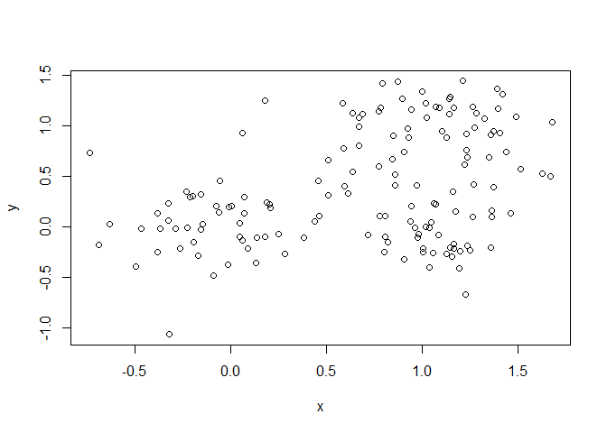

class08
================
Benjamin Cho
April 25, 2019

## K-means clustering

Start with an example of running **kmeans()** function

``` r
tmp <- c(rnorm(30,-3), rnorm(30,3))
x <- cbind(x=tmp, y=rev(tmp))
plot(x)
```

<!-- -->

Use the kmeans() function setting k to 2 and nstart=20 Inspect/print the
results Q. How many points are in each cluster? 30 Q. What ‘component’
of your result object details - cluster size?

  - cluster assignment/membership?
  - cluster center? Plot x colored by the kmeans cluster assignment and
    add cluster centers as blue points

<!-- end list -->

``` r
y <- kmeans(x, centers=2, nstart=20)
y
```

    ## K-means clustering with 2 clusters of sizes 30, 30
    ## 
    ## Cluster means:
    ##           x         y
    ## 1 -3.007659  3.138839
    ## 2  3.138839 -3.007659
    ## 
    ## Clustering vector:
    ##  [1] 1 1 1 1 1 1 1 1 1 1 1 1 1 1 1 1 1 1 1 1 1 1 1 1 1 1 1 1 1 1 2 2 2 2 2
    ## [36] 2 2 2 2 2 2 2 2 2 2 2 2 2 2 2 2 2 2 2 2 2 2 2 2 2
    ## 
    ## Within cluster sum of squares by cluster:
    ## [1] 58.5582 58.5582
    ##  (between_SS / total_SS =  90.6 %)
    ## 
    ## Available components:
    ## 
    ## [1] "cluster"      "centers"      "totss"        "withinss"    
    ## [5] "tot.withinss" "betweenss"    "size"         "iter"        
    ## [9] "ifault"

``` r
y$size
```

    ## [1] 30 30

``` r
y$cluster
```

    ##  [1] 1 1 1 1 1 1 1 1 1 1 1 1 1 1 1 1 1 1 1 1 1 1 1 1 1 1 1 1 1 1 2 2 2 2 2
    ## [36] 2 2 2 2 2 2 2 2 2 2 2 2 2 2 2 2 2 2 2 2 2 2 2 2 2

``` r
#plotting with color by the clustering
plot(x,col=y$cluster)
```

<!-- -->

\#\# heirarchical Clustering example

We must give the **hclust()** function a distance matrix not the raw
data as input

``` r
#distance matrix calculation
d <- dist(x)
d
```

    ##             1          2          3          4          5          6
    ## 2   0.6699912                                                       
    ## 3   3.1421133  2.6569158                                            
    ## 4   1.9053050  1.2796621  2.6159039                                 
    ## 5   2.9537469  2.2852128  1.8862633  1.3415768                      
    ## 6   2.8691529  2.2100178  2.4698572  1.0168667  0.6331861           
    ## 7   1.5646252  0.9265568  2.5232191  0.3563955  1.5252561  1.3149709
    ## 8   1.7103314  1.1305153  1.5599744  1.2749943  1.4791068  1.7080012
    ## 9   0.8523921  0.8576333  2.4240534  2.0091476  2.6917581  2.7943184
    ## 10  1.9172958  1.5206498  1.2508136  1.9724753  1.9894432  2.3386554
    ## 11  1.4473015  1.1576579  3.4788998  1.0898701  2.4313806  2.0525516
    ## 12  1.6965362  1.7509527  4.3006986  1.9800030  3.3211573  2.9127291
    ## 13  2.9189139  2.3102008  0.9439160  1.8654657  0.9427385  1.5396215
    ## 14  1.0666869  0.4362591  2.6154866  0.8466291  1.9479820  1.8052395
    ## 15  1.3803598  0.9103922  3.0554086  0.7192917  2.0453519  1.7266970
    ## 16  3.9552610  3.3410412  1.3548197  2.7353783  1.4737191  2.0820540
    ## 17  2.6483612  2.0334826  1.0670436  1.6184609  0.8817796  1.4155074
    ## 18  1.6428242  0.9728718  2.1508736  0.5722096  1.3190290  1.2685761
    ## 19  1.1713578  0.7887991  3.1451846  0.9485956  2.2538099  1.9626322
    ## 20  1.0466887  0.4437504  2.2177460  1.1766242  1.9467868  1.9725198
    ## 21  1.2143560  0.5493239  2.2495215  0.8970389  1.7399680  1.7139063
    ## 22  2.2364959  1.6233336  2.7723101  0.3487368  1.2636747  0.7969789
    ## 23  3.2164875  2.6068121  3.2325566  1.3281167  1.3710521  0.7631028
    ## 24  1.0943958  0.4245136  2.3859680  0.9239646  1.8612516  1.7998450
    ## 25  2.1213035  1.4719545  2.4473068  0.2820620  1.0623248  0.7573411
    ## 26  0.6549475  0.1727446  2.8089646  1.2510095  2.3407494  2.2186601
    ## 27  1.7573775  1.3723019  1.4076808  1.9009940  2.0260130  2.3354812
    ## 28  4.5067208  4.0091843  4.9444245  2.8337904  3.0635487  2.4818558
    ## 29  1.9436128  1.3602631  1.3619372  1.3534976  1.3309993  1.6366909
    ## 30  3.0794138  2.4169604  1.6946217  1.5635338  0.2583914  0.8867795
    ## 31  8.8801639  9.3032902 11.9599836  9.7130360 11.0399970 10.5532005
    ## 32  8.0308644  8.5139852 11.1594060  9.0698522 10.4108043  9.9730883
    ## 33  8.2062896  8.4137272 10.9304908  8.3864876  9.5900993  9.0072261
    ## 34  7.9077518  8.4285147 11.0492982  9.0751170 10.4155063 10.0104469
    ## 35  6.5397769  7.0204974  9.6662622  7.5928413  8.9343975  8.5095469
    ## 36  7.6160770  8.0257956 10.6814888  8.4235203  9.7507677  9.2660984
    ## 37  7.0193779  7.4905876 10.1402698  8.0334243  9.3742927  8.9369911
    ## 38  8.1251242  8.4595186 11.0875151  8.6896947  9.9816845  9.4511270
    ## 39  7.4861104  7.8749272 10.5266615  8.2299909  9.5508078  9.0550169
    ## 40  7.1641912  7.6352997 10.2850854  8.1756242  9.5163464  9.0774675
    ## 41  7.1142135  7.6028815 10.2452518  8.1839779  9.5255442  9.1005813
    ## 42  6.4303843  6.8652654  9.5218825  7.3387483  8.6762112  8.2205152
    ## 43  7.4583360  7.9070973 10.5624688  8.3928240  9.7301582  9.2723719
    ## 44  8.6776513  9.1422262 11.7945913  9.6477105 10.9856340 10.5287750
    ## 45  9.9647788 10.4155252 13.0711038 10.8763346 12.2089200 11.7336359
    ## 46  6.6283827  7.0516737  9.7085634  7.4962255  8.8308597  8.3652744
    ## 47  6.8393419  7.2997222  9.9525255  7.8213269  9.1614295  8.7182306
    ## 48  8.9572458  9.4215795 12.0740900  9.9234591 11.2609166 10.8018689
    ## 49  5.3698963  5.7675427  8.4227421  6.1891545  7.5238931  7.0612026
    ## 50  6.2467849  6.6559266  9.3120410  7.0784743  8.4114731  7.9420392
    ## 51  8.0678706  8.5884402 11.2094159  9.2328054 10.5733470 10.1668403
    ## 52  6.9301064  7.4675013 10.0719457  8.1666003  9.5025953  9.1216535
    ## 53  7.8016572  8.2876722 10.9316550  8.8531285 10.1943971  9.7609008
    ## 54  7.1685051  7.6022399 10.2590195  8.0595068  9.3946343  8.9296725
    ## 55  8.2821576  8.6665298 11.3163723  8.9996638 10.3145901  9.8090657
    ## 56  8.6727859  9.0872938 11.7432786  9.4805408 10.8052945 10.3145901
    ## 57  7.3343676  7.7457283 10.4017086  8.1516357  9.4805408  8.9996638
    ## 58  9.2943199  9.8016222 12.4334051 10.4017086 11.7432786 11.3163723
    ## 59  6.6711451  7.1591487  9.8016222  7.7457283  9.0872938  8.6665298
    ## 60  6.1537049  6.6711451  9.2943199  7.3343676  8.6727859  8.2821576
    ##             7          8          9         10         11         12
    ## 2                                                                   
    ## 3                                                                   
    ## 4                                                                   
    ## 5                                                                   
    ## 6                                                                   
    ## 7                                                                   
    ## 8   1.0584287                                                       
    ## 9   1.6587406  1.2395791                                            
    ## 10  1.7329261  0.6999001  1.1733171                                 
    ## 11  0.9898472  1.9443043  2.0042873  2.5348646                      
    ## 12  1.8707518  2.7431190  2.4755153  3.2567930  0.8928463           
    ## 13  1.8747065  1.2112662  2.4005255  1.3854233  2.8645414  3.7406978
    ## 14  0.4986695  1.0573092  1.2403311  1.6166447  0.9185967  1.6858420
    ## 15  0.5643986  1.5326236  1.7642553  2.1501332  0.4281636  1.3070856
    ## 16  2.8212328  2.2474206  3.4163956  2.3286398  3.7978641  4.6881065
    ## 17  1.6061513  0.9471028  2.1591843  1.2127896  2.5955398  3.4677330
    ## 18  0.3726660  0.7096197  1.5388934  1.4027413  1.3461114  2.2114636
    ## 19  0.7382051  1.5951511  1.6434245  2.1639762  0.3788421  1.1630939
    ## 20  0.8345164  0.6878568  0.8397266  1.1234674  1.4292944  2.1354157
    ## 21  0.5593530  0.6902349  1.1183332  1.2677525  1.2729236  2.0529990
    ## 22  0.7046121  1.5534453  2.3566873  2.2528387  1.2584378  2.1162959
    ## 23  1.6839874  2.3649587  3.3165568  3.0343140  2.0874472  2.8315435
    ## 24  0.5703414  0.8260401  1.0892101  1.3710625  1.1639295  1.9210961
    ## 25  0.5592889  1.2373372  2.1324171  1.9340451  1.3705584  2.2589833
    ## 26  0.9100150  1.2679536  1.0027000  1.6886092  1.0020026  1.5785304
    ## 27  1.6420242  0.6492557  1.0180824  0.1601191  2.4094244  3.1147040
    ## 28  3.1683983  4.0284134  4.8180393  4.7171970  3.1098380  3.4989875
    ## 29  1.1885575  0.2334909  1.4450303  0.7029424  2.1197163  2.9404065
    ## 30  1.7155140  1.5148129  2.7501436  1.9474761  2.6497818  3.5420232
    ## 31  9.6229019 10.4135570  9.7065322 10.7844499  8.6413521  7.7524379
    ## 32  8.9376414  9.6413533  8.8276809  9.9481301  7.9813818  7.0898493
    ## 33  8.4155892  9.3910131  9.0532026  9.9262066  7.4522283  6.6695227
    ## 34  8.9173898  9.5590246  8.6767666  9.8199931  7.9858129  7.1027285
    ## 35  7.4529548  8.1480199  7.3410212  8.4568332  6.5032483  5.6137776
    ## 36  8.3342932  9.1321771  8.4485619  9.5139123  7.3521667  6.4636705
    ## 37  7.9028117  8.6161837  7.8252168  8.9356721  6.9451272  6.0534302
    ## 38  8.6477862  9.5275689  8.9742668  9.9747557  7.6581128  6.7955275
    ## 39  8.1522230  8.9726027  8.3250413  9.3729356  7.1663127  6.2821341
    ## 40  8.0460280  8.7608017  7.9698127  9.0805054  7.0875436  6.1956683
    ## 41  8.0429978  8.7313552  7.9091450  9.0315043  7.0943379  6.2050150
    ## 42  7.2257067  7.9820470  7.2550520  8.3377927  6.2552736  5.3625057
    ## 43  8.2789545  9.0269974  8.2751877  9.3704980  7.3092728  6.4164806
    ## 44  9.5306113 10.2655630  9.4846288 10.5934004  8.5632197  7.6703735
    ## 45 10.7735449 11.5345130 10.7777402 11.8781596  9.7979082  8.9061795
    ## 46  7.3916683  8.1644140  7.4572780  8.5315585  6.4163528  5.5243959
    ## 47  7.6961458  8.4230747  7.6514277  8.7538890  6.7341792  5.8417647
    ## 48  9.8077981 10.5447365  9.7640110 10.8730095  8.8395044  7.9466721
    ## 49  6.0865722  6.8732407  6.2089384  7.2597999  5.1098020  4.2181989
    ## 50  6.9788117  7.7641484  7.0811223  8.1433923  6.0008793  5.1098020
    ## 51  9.0759596  9.7189528  8.8367166  9.9800874  8.1433923  7.2597999
    ## 52  7.9925005  8.5969948  7.6863944  8.8367166  7.0811223  6.2089384
    ## 53  8.7178405  9.4155671  8.5969948  9.7189528  7.7641484  6.8732407
    ## 54  7.9528372  8.7178405  7.9925005  9.0759596  6.9788117  6.0865722
    ## 55  8.9296725  9.7609008  9.1216535 10.1668403  7.9420392  7.0612026
    ## 56  9.3946343 10.1943971  9.5025953 10.5733470  8.4114731  7.5238931
    ## 57  8.0595068  8.8531285  8.1666003  9.2328054  7.0784743  6.1891545
    ## 58 10.2590195 10.9316550 10.0719457 11.2094159  9.3120410  8.4227421
    ## 59  7.6022399  8.2876722  7.4675013  8.5884402  6.6559266  5.7675427
    ## 60  7.1685051  7.8016572  6.9301064  8.0678706  6.2467849  5.3698963
    ##            13         14         15         16         17         18
    ## 2                                                                   
    ## 3                                                                   
    ## 4                                                                   
    ## 5                                                                   
    ## 6                                                                   
    ## 7                                                                   
    ## 8                                                                   
    ## 9                                                                   
    ## 10                                                                  
    ## 11                                                                  
    ## 12                                                                  
    ## 13                                                                  
    ## 14  2.1218581                                                       
    ## 15  2.4383689  0.5612284                                            
    ## 16  1.0364653  3.1263592  3.3819230                                 
    ## 17  0.2796100  1.8425455  2.1683299  1.3086298                      
    ## 18  1.5307616  0.6376968  0.9179779  2.5086731  1.2564166           
    ## 19  2.5847504  0.5486053  0.2450391  3.5534792  2.3095919  1.0540824
    ## 20  1.8802370  0.5192869  1.0791063  2.9149341  1.6063828  0.7058938
    ## 21  1.7942058  0.3675509  0.8826305  2.8150779  1.5148935  0.4468977
    ## 22  1.9471525  1.1880694  0.9629013  2.7214803  1.7289915  0.8810892
    ## 23  2.2990927  2.1718772  1.8929876  2.7400004  2.1779757  1.7906013
    ## 24  1.9387990  0.2456459  0.7941530  2.9585515  1.6594224  0.5490527
    ## 25  1.6452581  1.0546984  0.9995879  2.4752068  1.4147991  0.6044024
    ## 26  2.4256923  0.4134818  0.7937650  3.4504448  2.1471110  1.0217602
    ## 27  1.4855143  1.4910524  2.0337660  2.4532672  1.2920063  1.3287924
    ## 28  4.0042220  3.5868123  3.1329613  4.2978031  3.8971693  3.3826968
    ## 29  0.9802946  1.2577428  1.6993044  2.0157036  0.7208929  0.8196886
    ## 30  0.7569324  2.1083066  2.2529231  1.2171086  0.7654965  1.4712058
    ## 31 11.4869511  9.3837852  9.0595228 12.4391949 11.2111375  9.9563363
    ## 32 10.7676970  8.6462991  8.3832004 11.7554525 10.4886322  9.2485536
    ## 33 10.2518915  8.3396152  7.8751088 11.0620476 10.0001145  8.7852028
    ## 34 10.7134665  8.5945096  8.3733933 11.7189597 10.4338586  9.2114221
    ## 35  9.2770841  7.1553465  6.9009589 10.2682230  8.9978689  7.7602753
    ## 36 10.1995444  8.0991654  7.7707422 11.1499569  9.9240668  8.6688161
    ## 37  9.7364464  7.6157264  7.3476748 10.7215259  9.4575811  8.2154754
    ## 38 10.5220566  8.4742554  8.0854190 11.4232156 10.2536368  9.0010185
    ## 39 10.0223560  7.9325315  7.5879363 10.9615940  9.7483398  8.4920203
    ## 40  9.8804763  7.7598777  7.4905941 10.8650021  9.6016435  8.3591870
    ## 41  9.8644045  7.7425530  7.4915400 10.8573257  9.5850883  8.3490748
    ## 42  9.0768004  6.9629260  6.6657076 10.0469071  8.7992290  7.5490181
    ## 43 10.1279200  8.0122152  7.7193104 11.1001872  9.8500705  8.6009818
    ## 44 11.3752954  9.2571993  8.9718895 12.3516855 11.0970245  9.8500705
    ## 45 12.6289559 10.5163085 10.2119625 13.5938801 12.3516855 11.1001872
    ## 46  9.2487585  7.1393130  6.8300422 10.2119625  8.9718895  7.7193104
    ## 47  9.5357288  7.4164714  7.1393130 10.5163085  9.2571993  8.0122152
    ## 48 11.6534989  9.5357288  9.2487585 12.6289559 11.3752954 10.1279200
    ## 49  7.9466721  5.8417647  5.5243959  8.9061795  7.6703735  6.4164806
    ## 50  8.8395044  6.7341792  6.4163528  9.7979082  8.5632197  7.3092728
    ## 51 10.8730095  8.7538890  8.5315585 11.8781596 10.5934004  9.3704980
    ## 52  9.7640110  7.6514277  7.4572780 10.7777402  9.4846288  8.2751877
    ## 53 10.5447365  8.4230747  8.1644140 11.5345130 10.2655630  9.0269974
    ## 54  9.8077981  7.6961458  7.3916683 10.7735449  9.5306113  8.2789545
    ## 55 10.8018689  8.7182306  8.3652744 11.7336359 10.5287750  9.2723719
    ## 56 11.2609166  9.1614295  8.8308597 12.2089200 10.9856340  9.7301582
    ## 57  9.9234591  7.8213269  7.4962255 10.8763346  9.6477105  8.3928240
    ## 58 12.0740900  9.9525255  9.7085634 13.0711038 11.7945913 10.5624688
    ## 59  9.4215795  7.2997222  7.0516737 10.4155252  9.1422262  7.9070973
    ## 60  8.9572458  6.8393419  6.6283827  9.9647788  8.6776513  7.4583360
    ##            19         20         21         22         23         24
    ## 2                                                                   
    ## 3                                                                   
    ## 4                                                                   
    ## 5                                                                   
    ## 6                                                                   
    ## 7                                                                   
    ## 8                                                                   
    ## 9                                                                   
    ## 10                                                                  
    ## 11                                                                  
    ## 12                                                                  
    ## 13                                                                  
    ## 14                                                                  
    ## 15                                                                  
    ## 16                                                                  
    ## 17                                                                  
    ## 18                                                                  
    ## 19                                                                  
    ## 20  1.0522881                                                       
    ## 21  0.9116173  0.2800924                                            
    ## 22  1.2066435  1.5218704  1.2418206                                 
    ## 23  2.1363891  2.4768819  2.1985658  0.9838620                      
    ## 24  0.7939667  0.2917837  0.1448477  1.2726451  2.2451947           
    ## 25  1.2245806  1.2930417  1.0172887  0.3322021  1.1872153  1.0789279
    ## 26  0.6431201  0.5912952  0.6365240  1.5852159  2.5676036  0.4957063
    ## 27  2.0355682  0.9874568  1.1520541  2.1952925  3.0110628  1.2464666
    ## 28  3.3356524  4.0028972  3.7260791  2.5022528  1.7215525  3.7315574
    ## 29  1.7832727  0.9190742  0.8956286  1.5957073  2.3338535  1.0366324
    ## 30  2.4516775  2.0500142  1.8676852  1.5109242  1.6087762  1.9975259
    ## 31  8.9022574  9.7425352  9.7373244  9.7871503 10.2264009  9.5948869
    ## 32  8.2024292  8.9576067  8.9851267  9.1860217  9.7319235  8.8405726
    ## 33  7.7961198  8.8047316  8.7062754  8.3458695  8.4916968  8.5809682
    ## 34  8.1792060  8.8715570  8.9208614  9.2163030  9.8213275  8.7760310
    ## 35  6.7165563  7.4641305  7.4928483  7.7188004  8.2968930  7.3482303
    ## 36  7.6147956  8.4637428  8.4540217  8.4985807  8.9481584  8.3119740
    ## 37  7.1681664  7.9339063  7.9565924  8.1495647  8.7015487  7.8121985
    ## 38  7.9584899  8.8843518  8.8386775  8.7180540  9.0468837  8.7015487
    ## 39  7.4390473  8.3100022  8.2905377  8.2941799  8.7180540  8.1495647
    ## 40  7.3115855  8.0786020  8.1009694  8.2905377  8.8386775  7.9565924
    ## 41  7.3063269  8.0466121  8.0786020  8.3100022  8.8843518  7.9339063
    ## 42  6.4965357  7.3063269  7.3115855  7.4390473  7.9584899  7.1681664
    ## 43  7.5490181  8.3490748  8.3591870  8.4920203  9.0010185  8.2154754
    ## 44  8.7992290  9.5850883  9.6016435  9.7483398 10.2536368  9.4575811
    ## 45 10.0469071 10.8573257 10.8650021 10.9615940 11.4232156 10.7215259
    ## 46  6.6657076  7.4915400  7.4905941  7.5879363  8.0854190  7.3476748
    ## 47  6.9629260  7.7425530  7.7598777  7.9325315  8.4742554  7.6157264
    ## 48  9.0768004  9.8644045  9.8804763 10.0223560 10.5220566  9.7364464
    ## 49  5.3625057  6.2050150  6.1956683  6.2821341  6.7955275  6.0534302
    ## 50  6.2552736  7.0943379  7.0875436  7.1663127  7.6581128  6.9451272
    ## 51  8.3377927  9.0315043  9.0805054  9.3729356  9.9747557  8.9356721
    ## 52  7.2550520  7.9091450  7.9698127  8.3250413  8.9742668  7.8252168
    ## 53  7.9820470  8.7313552  8.7608017  8.9726027  9.5275689  8.6161837
    ## 54  7.2257067  8.0429978  8.0460280  8.1522230  8.6477862  7.9028117
    ## 55  8.2205152  9.1005813  9.0774675  9.0550169  9.4511270  8.9369911
    ## 56  8.6762112  9.5255442  9.5163464  9.5508078  9.9816845  9.3742927
    ## 57  7.3387483  8.1839779  8.1756242  8.2299909  8.6896947  8.0334243
    ## 58  9.5218825 10.2452518 10.2850854 10.5266615 11.0875151 10.1402698
    ## 59  6.8652654  7.6028815  7.6352997  7.8749272  8.4595186  7.4905876
    ## 60  6.4303843  7.1142135  7.1641912  7.4861104  8.1251242  7.0193779
    ##            25         26         27         28         29         30
    ## 2                                                                   
    ## 3                                                                   
    ## 4                                                                   
    ## 5                                                                   
    ## 6                                                                   
    ## 7                                                                   
    ## 8                                                                   
    ## 9                                                                   
    ## 10                                                                  
    ## 11                                                                  
    ## 12                                                                  
    ## 13                                                                  
    ## 14                                                                  
    ## 15                                                                  
    ## 16                                                                  
    ## 17                                                                  
    ## 18                                                                  
    ## 19                                                                  
    ## 20                                                                  
    ## 21                                                                  
    ## 22                                                                  
    ## 23                                                                  
    ## 24                                                                  
    ## 25                                                                  
    ## 26  1.4677417                                                       
    ## 27  1.8841884  1.5417633                                            
    ## 28  2.7959269  3.9184448  4.6773732                                 
    ## 29  1.2671394  1.4935083  0.7054769  4.0260935                      
    ## 30  1.2895161  2.4872035  2.0037704  3.2811431  1.3363978           
    ## 31  9.9841740  9.1516540 10.6262458  9.8453017 10.6310906 11.2736184
    ## 32  9.3484931  8.3736184  9.7882394  9.5718822  9.8667637 10.6310906
    ## 33  8.6180477  8.2426151  9.7830593  7.6429822  9.5718822  9.8453017
    ## 34  9.3562925  8.2970261  9.6598981  9.7830593  9.7882394 10.6262458
    ## 35  7.8725505  6.8803632  8.2970261  8.2426151  8.3736184  9.1516540
    ## 36  8.6947132  7.8725505  9.3562925  8.6180477  9.3484931  9.9841740
    ## 37  8.3119740  7.3482303  8.7760310  8.5809682  8.8405726  9.5948869
    ## 38  8.9481584  8.2968930  9.8213275  8.4916968  9.7319235 10.2264009
    ## 39  8.4985807  7.7188004  9.2163030  8.3458695  9.1860217  9.7871503
    ## 40  8.4540217  7.4928483  8.9208614  8.7062754  8.9851267  9.7373244
    ## 41  8.4637428  7.4641305  8.8715570  8.8047316  8.9576067  9.7425352
    ## 42  7.6147956  6.7165563  8.1792060  7.7961198  8.2024292  8.9022574
    ## 43  8.6688161  7.7602753  9.2114221  8.7852028  9.2485536  9.9563363
    ## 44  9.9240668  8.9978689 10.4338586 10.0001145 10.4886322 11.2111375
    ## 45 11.1499569 10.2682230 11.7189597 11.0620476 11.7554525 12.4391949
    ## 46  7.7707422  6.9009589  8.3733933  7.8751088  8.3832004  9.0595228
    ## 47  8.0991654  7.1553465  8.5945096  8.3396152  8.6462991  9.3837852
    ## 48 10.1995444  9.2770841 10.7134665 10.2518915 10.7676970 11.4869511
    ## 49  6.4636705  5.6137776  7.1027285  6.6695227  7.0898493  7.7524379
    ## 50  7.3521667  6.5032483  7.9858129  7.4522283  7.9813818  8.6413521
    ## 51  9.5139123  8.4568332  9.8199931  9.9262066  9.9481301 10.7844499
    ## 52  8.4485619  7.3410212  8.6767666  9.0532026  8.8276809  9.7065322
    ## 53  9.1321771  8.1480199  9.5590246  9.3910131  9.6413533 10.4135570
    ## 54  8.3342932  7.4529548  8.9173898  8.4155892  8.9376414  9.6229019
    ## 55  9.2660984  8.5095469 10.0104469  9.0072261  9.9730883 10.5532005
    ## 56  9.7507677  8.9343975 10.4155063  9.5900993 10.4108043 11.0399970
    ## 57  8.4235203  7.5928413  9.0751170  8.3864876  9.0698522  9.7130360
    ## 58 10.6814888  9.6662622 11.0492982 10.9304908 11.1594060 11.9599836
    ## 59  8.0257956  7.0204974  8.4285147  8.4137272  8.5139852  9.3032902
    ## 60  7.6160770  6.5397769  7.9077518  8.2062896  8.0308644  8.8801639
    ##            31         32         33         34         35         36
    ## 2                                                                   
    ## 3                                                                   
    ## 4                                                                   
    ## 5                                                                   
    ## 6                                                                   
    ## 7                                                                   
    ## 8                                                                   
    ## 9                                                                   
    ## 10                                                                  
    ## 11                                                                  
    ## 12                                                                  
    ## 13                                                                  
    ## 14                                                                  
    ## 15                                                                  
    ## 16                                                                  
    ## 17                                                                  
    ## 18                                                                  
    ## 19                                                                  
    ## 20                                                                  
    ## 21                                                                  
    ## 22                                                                  
    ## 23                                                                  
    ## 24                                                                  
    ## 25                                                                  
    ## 26                                                                  
    ## 27                                                                  
    ## 28                                                                  
    ## 29                                                                  
    ## 30                                                                  
    ## 31                                                                  
    ## 32  1.3363978                                                       
    ## 33  3.2811431  4.0260935                                            
    ## 34  2.0037704  0.7054769  4.6773732                                 
    ## 35  2.4872035  1.4935083  3.9184448  1.5417633                      
    ## 36  1.2895161  1.2671394  2.7959269  1.8841884  1.4677417           
    ## 37  1.9975259  1.0366324  3.7315574  1.2464666  0.4957063  1.0789279
    ## 38  1.6087762  2.3338535  1.7215525  3.0110628  2.5676036  1.1872153
    ## 39  1.5109242  1.5957073  2.5022528  2.1952925  1.5852159  0.3322021
    ## 40  1.8676852  0.8956286  3.7260791  1.1520541  0.6365240  1.0172887
    ## 41  2.0500142  0.9190742  4.0028972  0.9874568  0.5912952  1.2930417
    ## 42  2.4516775  1.7832727  3.3356524  2.0355682  0.6431201  1.2245806
    ## 43  1.4712058  0.8196886  3.3826968  1.3287924  1.0217602  0.6044024
    ## 44  0.7654965  0.7208929  3.8971693  1.2920063  2.1471110  1.4147991
    ## 45  1.2171086  2.0157036  4.2978031  2.4532672  3.4504448  2.4752068
    ## 46  2.2529231  1.6993044  3.1329613  2.0337660  0.7937650  0.9995879
    ## 47  2.1083066  1.2577428  3.5868123  1.4910524  0.4134818  1.0546984
    ## 48  0.7569324  0.9802946  4.0042220  1.4855143  2.4256923  1.6452581
    ## 49  3.5420232  2.9404065  3.4989875  3.1147040  1.5785304  2.2589833
    ## 50  2.6497818  2.1197163  3.1098380  2.4094244  1.0020026  1.3705584
    ## 51  1.9474761  0.7029424  4.7171970  0.1601191  1.6886092  1.9340451
    ## 52  2.7501436  1.4450303  4.8180393  1.0180824  1.0027000  2.1324171
    ## 53  1.5148129  0.2334909  4.0284134  0.6492557  1.2679536  1.2373372
    ## 54  1.7155140  1.1885575  3.1683983  1.6420242  0.9100150  0.5592889
    ## 55  0.8867795  1.6366909  2.4818558  2.3354812  2.2186601  0.7573411
    ## 56  0.2583914  1.3309993  3.0635487  2.0260130  2.3407494  1.0623248
    ## 57  1.5635338  1.3534976  2.8337904  1.9009940  1.2510095  0.2820620
    ## 58  1.6946217  1.3619372  4.9444245  1.4076808  2.8089646  2.4473068
    ## 59  2.4169604  1.3602631  4.0091843  1.3723019  0.1727446  1.4719545
    ## 60  3.0794138  1.9436128  4.5067208  1.7573775  0.6549475  2.1213035
    ##            37         38         39         40         41         42
    ## 2                                                                   
    ## 3                                                                   
    ## 4                                                                   
    ## 5                                                                   
    ## 6                                                                   
    ## 7                                                                   
    ## 8                                                                   
    ## 9                                                                   
    ## 10                                                                  
    ## 11                                                                  
    ## 12                                                                  
    ## 13                                                                  
    ## 14                                                                  
    ## 15                                                                  
    ## 16                                                                  
    ## 17                                                                  
    ## 18                                                                  
    ## 19                                                                  
    ## 20                                                                  
    ## 21                                                                  
    ## 22                                                                  
    ## 23                                                                  
    ## 24                                                                  
    ## 25                                                                  
    ## 26                                                                  
    ## 27                                                                  
    ## 28                                                                  
    ## 29                                                                  
    ## 30                                                                  
    ## 31                                                                  
    ## 32                                                                  
    ## 33                                                                  
    ## 34                                                                  
    ## 35                                                                  
    ## 36                                                                  
    ## 37                                                                  
    ## 38  2.2451947                                                       
    ## 39  1.2726451  0.9838620                                            
    ## 40  0.1448477  2.1985658  1.2418206                                 
    ## 41  0.2917837  2.4768819  1.5218704  0.2800924                      
    ## 42  0.7939667  2.1363891  1.2066435  0.9116173  1.0522881           
    ## 43  0.5490527  1.7906013  0.8810892  0.4468977  0.7058938  1.0540824
    ## 44  1.6594224  2.1779757  1.7289915  1.5148935  1.6063828  2.3095919
    ## 45  2.9585515  2.7400004  2.7214803  2.8150779  2.9149341  3.5534792
    ## 46  0.7941530  1.8929876  0.9629013  0.8826305  1.0791063  0.2450391
    ## 47  0.2456459  2.1718772  1.1880694  0.3675509  0.5192869  0.5486053
    ## 48  1.9387990  2.2990927  1.9471525  1.7942058  1.8802370  2.5847504
    ## 49  1.9210961  2.8315435  2.1162959  2.0529990  2.1354157  1.1630939
    ## 50  1.1639295  2.0874472  1.2584378  1.2729236  1.4292944  0.3788421
    ## 51  1.3710625  3.0343140  2.2528387  1.2677525  1.1234674  2.1639762
    ## 52  1.0892101  3.3165568  2.3566873  1.1183332  0.8397266  1.6434245
    ## 53  0.8260401  2.3649587  1.5534453  0.6902349  0.6878568  1.5951511
    ## 54  0.5703414  1.6839874  0.7046121  0.5593530  0.8345164  0.7382051
    ## 55  1.7998450  0.7631028  0.7969789  1.7139063  1.9725198  1.9626322
    ## 56  1.8612516  1.3710521  1.2636747  1.7399680  1.9467868  2.2538099
    ## 57  0.9239646  1.3281167  0.3487368  0.8970389  1.1766242  0.9485956
    ## 58  2.3859680  3.2325566  2.7723101  2.2495215  2.2177460  3.1451846
    ## 59  0.4245136  2.6068121  1.6233336  0.5493239  0.4437504  0.7887991
    ## 60  1.0943958  3.2164875  2.2364959  1.2143560  1.0466887  1.1713578
    ##            43         44         45         46         47         48
    ## 2                                                                   
    ## 3                                                                   
    ## 4                                                                   
    ## 5                                                                   
    ## 6                                                                   
    ## 7                                                                   
    ## 8                                                                   
    ## 9                                                                   
    ## 10                                                                  
    ## 11                                                                  
    ## 12                                                                  
    ## 13                                                                  
    ## 14                                                                  
    ## 15                                                                  
    ## 16                                                                  
    ## 17                                                                  
    ## 18                                                                  
    ## 19                                                                  
    ## 20                                                                  
    ## 21                                                                  
    ## 22                                                                  
    ## 23                                                                  
    ## 24                                                                  
    ## 25                                                                  
    ## 26                                                                  
    ## 27                                                                  
    ## 28                                                                  
    ## 29                                                                  
    ## 30                                                                  
    ## 31                                                                  
    ## 32                                                                  
    ## 33                                                                  
    ## 34                                                                  
    ## 35                                                                  
    ## 36                                                                  
    ## 37                                                                  
    ## 38                                                                  
    ## 39                                                                  
    ## 40                                                                  
    ## 41                                                                  
    ## 42                                                                  
    ## 43                                                                  
    ## 44  1.2564166                                                       
    ## 45  2.5086731  1.3086298                                            
    ## 46  0.9179779  2.1683299  3.3819230                                 
    ## 47  0.6376968  1.8425455  3.1263592  0.5612284                      
    ## 48  1.5307616  0.2796100  1.0364653  2.4383689  2.1218581           
    ## 49  2.2114636  3.4677330  4.6881065  1.3070856  1.6858420  3.7406978
    ## 50  1.3461114  2.5955398  3.7978641  0.4281636  0.9185967  2.8645414
    ## 51  1.4027413  1.2127896  2.3286398  2.1501332  1.6166447  1.3854233
    ## 52  1.5388934  2.1591843  3.4163956  1.7642553  1.2403311  2.4005255
    ## 53  0.7096197  0.9471028  2.2474206  1.5326236  1.0573092  1.2112662
    ## 54  0.3726660  1.6061513  2.8212328  0.5643986  0.4986695  1.8747065
    ## 55  1.2685761  1.4155074  2.0820540  1.7266970  1.8052395  1.5396215
    ## 56  1.3190290  0.8817796  1.4737191  2.0453519  1.9479820  0.9427385
    ## 57  0.5722096  1.6184609  2.7353783  0.7192917  0.8466291  1.8654657
    ## 58  2.1508736  1.0670436  1.3548197  3.0554086  2.6154866  0.9439160
    ## 59  0.9728718  2.0334826  3.3410412  0.9103922  0.4362591  2.3102008
    ## 60  1.6428242  2.6483612  3.9552610  1.3803598  1.0666869  2.9189139
    ##            49         50         51         52         53         54
    ## 2                                                                   
    ## 3                                                                   
    ## 4                                                                   
    ## 5                                                                   
    ## 6                                                                   
    ## 7                                                                   
    ## 8                                                                   
    ## 9                                                                   
    ## 10                                                                  
    ## 11                                                                  
    ## 12                                                                  
    ## 13                                                                  
    ## 14                                                                  
    ## 15                                                                  
    ## 16                                                                  
    ## 17                                                                  
    ## 18                                                                  
    ## 19                                                                  
    ## 20                                                                  
    ## 21                                                                  
    ## 22                                                                  
    ## 23                                                                  
    ## 24                                                                  
    ## 25                                                                  
    ## 26                                                                  
    ## 27                                                                  
    ## 28                                                                  
    ## 29                                                                  
    ## 30                                                                  
    ## 31                                                                  
    ## 32                                                                  
    ## 33                                                                  
    ## 34                                                                  
    ## 35                                                                  
    ## 36                                                                  
    ## 37                                                                  
    ## 38                                                                  
    ## 39                                                                  
    ## 40                                                                  
    ## 41                                                                  
    ## 42                                                                  
    ## 43                                                                  
    ## 44                                                                  
    ## 45                                                                  
    ## 46                                                                  
    ## 47                                                                  
    ## 48                                                                  
    ## 49                                                                  
    ## 50  0.8928463                                                       
    ## 51  3.2567930  2.5348646                                            
    ## 52  2.4755153  2.0042873  1.1733171                                 
    ## 53  2.7431190  1.9443043  0.6999001  1.2395791                      
    ## 54  1.8707518  0.9898472  1.7329261  1.6587406  1.0584287           
    ## 55  2.9127291  2.0525516  2.3386554  2.7943184  1.7080012  1.3149709
    ## 56  3.3211573  2.4313806  1.9894432  2.6917581  1.4791068  1.5252561
    ## 57  1.9800030  1.0898701  1.9724753  2.0091476  1.2749943  0.3563955
    ## 58  4.3006986  3.4788998  1.2508136  2.4240534  1.5599744  2.5232191
    ## 59  1.7509527  1.1576579  1.5206498  0.8576333  1.1305153  0.9265568
    ## 60  1.6965362  1.4473015  1.9172958  0.8523921  1.7103314  1.5646252
    ##            55         56         57         58         59
    ## 2                                                        
    ## 3                                                        
    ## 4                                                        
    ## 5                                                        
    ## 6                                                        
    ## 7                                                        
    ## 8                                                        
    ## 9                                                        
    ## 10                                                       
    ## 11                                                       
    ## 12                                                       
    ## 13                                                       
    ## 14                                                       
    ## 15                                                       
    ## 16                                                       
    ## 17                                                       
    ## 18                                                       
    ## 19                                                       
    ## 20                                                       
    ## 21                                                       
    ## 22                                                       
    ## 23                                                       
    ## 24                                                       
    ## 25                                                       
    ## 26                                                       
    ## 27                                                       
    ## 28                                                       
    ## 29                                                       
    ## 30                                                       
    ## 31                                                       
    ## 32                                                       
    ## 33                                                       
    ## 34                                                       
    ## 35                                                       
    ## 36                                                       
    ## 37                                                       
    ## 38                                                       
    ## 39                                                       
    ## 40                                                       
    ## 41                                                       
    ## 42                                                       
    ## 43                                                       
    ## 44                                                       
    ## 45                                                       
    ## 46                                                       
    ## 47                                                       
    ## 48                                                       
    ## 49                                                       
    ## 50                                                       
    ## 51                                                       
    ## 52                                                       
    ## 53                                                       
    ## 54                                                       
    ## 55                                                       
    ## 56  0.6331861                                            
    ## 57  1.0168667  1.3415768                                 
    ## 58  2.4698572  1.8862633  2.6159039                      
    ## 59  2.2100178  2.2852128  1.2796621  2.6569158           
    ## 60  2.8691529  2.9537469  1.9053050  3.1421133  0.6699912

``` r
#clustering
hc <- hclust(d)
plot(hc)
```

<!-- -->

``` r
cutree(hc, k=2)
```

    ##  [1] 1 1 1 1 1 1 1 1 1 1 1 1 1 1 1 1 1 1 1 1 1 1 1 1 1 1 1 1 1 1 2 2 2 2 2
    ## [36] 2 2 2 2 2 2 2 2 2 2 2 2 2 2 2 2 2 2 2 2 2 2 2 2 2

\# Step 1. Generate some example data for clustering x \<- rbind(
matrix(rnorm(100, mean=0, sd = 0.3), ncol = 2), \# c1 matrix(rnorm(100,
mean = 1, sd = 0.3), ncol = 2), \# c2 matrix(c(rnorm(50, mean = 1, sd =
0.3), \# c3 rnorm(50, mean = 0, sd = 0.3)), ncol = 2)) colnames(x) \<-
c(“x”, “y”) \# Step 2. Plot the data without clustering plot(x) \# Step
3. Generate colors for known clusters \# (just so we can compare to
hclust results) col \<- as.factor( rep(c(“c1”,“c2”,“c3”), each=50) )
plot(x, col=col)

``` r
x <- rbind(
 matrix(rnorm(100, mean=0, sd = 0.3), ncol = 2), # c1
 matrix(rnorm(100, mean = 1, sd = 0.3), ncol = 2), # c2
 matrix(c(rnorm(50, mean = 1, sd = 0.3), # c3
 rnorm(50, mean = 0, sd = 0.3)), ncol = 2))
colnames(x) <- c("x", "y")
plot(x)
```

<!-- -->

``` r
col <- as.factor( rep(c("c1","c2","c3"), each=50) )
plot(x, col=col)
```

<!-- -->

Q. Use the dist(), hclust(), plot() and cutree() functions to return 2
and 3 clusters Q. How does this compare to your known ‘col’ groups?

``` r
d <- dist(x)
hc <- hclust(d)
plot(hc)
abline(h=2, col="red")
```

<!-- -->

``` r
hc2 <- cutree(hc, k=2)
hc3 <- cutree(hc, k=3)
```

``` r
plot(x, col=hc3)
```

<!-- -->

# PCA: Principal Component Analysis

``` r
mydata <- read.csv("https://tinyurl.com/expression-CSV",
 row.names=1) 
mydata
```

    ##          wt1 wt2  wt3  wt4  wt5 ko1  ko2  ko3  ko4  ko5
    ## gene1    439 458  408  429  420  90   88   86   90   93
    ## gene2    219 200  204  210  187 427  423  434  433  426
    ## gene3   1006 989 1030 1017  973 252  237  238  226  210
    ## gene4    783 792  829  856  760 849  856  835  885  894
    ## gene5    181 249  204  244  225 277  305  272  270  279
    ## gene6    460 502  491  491  493 612  594  577  618  638
    ## gene7     27  30   37   29   34 304  304  285  311  285
    ## gene8    175 182  184  166  180 255  291  305  271  269
    ## gene9    658 669  653  633  657 628  627  603  635  620
    ## gene10   121 116  134  117  133 931  941  990  982  934
    ## gene11   337 337  330  322  313 100   95   94  101   79
    ## gene12   214 194  213  192  207  97   91   89  124   97
    ## gene13   789 738  807  768  820 293  308  312  303  325
    ## gene14   458 490  493  446  496 694  682  679  702  719
    ## gene15   551 555  527  552  503 712  742  718  808  739
    ## gene16   390 400  403  402  401 755  765  730  713  740
    ## gene17   900 970  905  850  834 353  380  380  385  386
    ## gene18   951 991  991  983  984 217  195  195  196  197
    ## gene19   436 414  388  418  410 162  169  143  151  130
    ## gene20   244 266  228  223  240 540  536  577  538  513
    ## gene21   119  87   87   88   93 914  906  914  913  921
    ## gene22   156 170  150  167  155 346  372  393  416  384
    ## gene23    89  97   96   97   82 788  786  750  822  785
    ## gene24   570 567  563  587  563 424  481  489  456  465
    ## gene25   788 796  766  778  825 456  403  446  447  442
    ## gene26  1007 972  977 1003 1027 945  859  933  844  925
    ## gene27   937 876  901  958  957 414  405  383  437  394
    ## gene28   224 232  231  238  226 850  902  907  842  817
    ## gene29   809 869  815  788  781 482  484  518  498  491
    ## gene30   624 598  587  552  592 956  985  940  963  982
    ## gene31   218 259  213  204  213  69   86   59   65   46
    ## gene32   906 798  828  874  890 541  626  576  607  586
    ## gene33   262 291  258  271  279 534  566  570  565  563
    ## gene34   155 172  173  173  192 643  639  713  706  676
    ## gene35   100 104   94  114   90 212  228  233  229  258
    ## gene36   117 147  120  147  145 353  347  371  335  357
    ## gene37   286 262  260  270  293 360  375  361  348  374
    ## gene38   321 353  334  340  316 642  575  588  595  665
    ## gene39   388 372  345  373  359  50   45   39   44   35
    ## gene40   606 576  558  581  574 415  406  423  455  412
    ## gene41   379 377  362  346  354 991 1010 1020  976 1036
    ## gene42   471 492  473  470  471 401  401  426  425  418
    ## gene43   592 615  602  602  655 514  554  501  511  553
    ## gene44   755 733  775  687  776 255  245  251  249  252
    ## gene45    35  40   28   25   32 947  988  994  989  971
    ## gene46   758 734  704  761  672 567  575  596  607  611
    ## gene47    24  25   12   13   22 324  293  292  303  295
    ## gene48   100 113  136  117  103 912  940  901  950  868
    ## gene49   809 825  833  800  776 538  524  487  527  507
    ## gene50   955 994  994  975  973 175  158  191  218  183
    ## gene51   453 419  443  459  469 174  134  166  148  154
    ## gene52   327 320  324  321  318 489  470  495  451  457
    ## gene53   657 669  631  701  647 246  276  255  266  287
    ## gene54   678 638  676  683  671 259  247  238  214  235
    ## gene55   304 325  312  327  320 819  802  773  790  820
    ## gene56   659 687  659  667  639 109  102  105  119   96
    ## gene57   673 668  694  699  726  18   14   19   18   14
    ## gene58   785 772  817  766  784 467  474  460  461  481
    ## gene59   501 513  462  484  504  37   64   71   58   50
    ## gene60   232 228  193  247  231 997  983  997  990 1011
    ## gene61   928 936 1015  971  964 428  457  447  434  431
    ## gene62   159 169  163  151  166 869  975  955  929  948
    ## gene63   336 344  372  389  357 664  575  577  625  630
    ## gene64   968 888  907  914  883 886  855  844  848  862
    ## gene65   339 335  373  338  328 275  290  270  303  280
    ## gene66    35  32   45   37   38 765  746  756  758  761
    ## gene67    27  28   25   35   27 200  194  189  181  173
    ## gene68    80  69   87   87   81 693  693  677  683  688
    ## gene69   744 685  733  693  746 745  680  780  791  792
    ## gene70   766 739  751  720  738 645  603  610  598  612
    ## gene71   672 736  672  715  693 839  872  909  811  803
    ## gene72   526 553  534  511  529 922  819  878  832  853
    ## gene73   627 650  664  622  606 805  836  836  828  800
    ## gene74   468 466  477  469  494 703  661  669  632  640
    ## gene75   986 945 1006 1020 1024 359  358  346  356  345
    ## gene76   348 333  344  321  296 770  773  750  769  774
    ## gene77   719 714  734  693  682 620  567  582  614  546
    ## gene78   883 899  868  873  882 803  765  767  783  749
    ## gene79   837 883  864  807  854 210  239  234  258  220
    ## gene80   666 657  719  656  638 549  588  586  571  583
    ## gene81   804 735  771  763  813 613  587  591  563  613
    ## gene82   476 494  521  494  482 183  184  156  173  161
    ## gene83   438 430  477  457  481 466  525  518  474  478
    ## gene84   938 934  976  965  960 904 1011  949  947  934
    ## gene85    29  29   30   19   21 618  589  618  563  574
    ## gene86   810 830  760  796  807 486  542  507  471  543
    ## gene87   575 579  567  565  576 352  321  296  332  311
    ## gene88   451 471  494  447  470 540  583  572  551  591
    ## gene89   174 170  205  175  179 298  290  319  313  264
    ## gene90   158 122  138  159  128 863  896  869  841  873
    ## gene91   371 367  369  339  360 103   85   83   94   70
    ## gene92   853 798  866  843  823 934 1007  936  918 1005
    ## gene93   208 214  200  196  206 409  408  403  368  380
    ## gene94   555 584  574  599  581 292  341  335  324  299
    ## gene95   527 573  548  548  552 686  718  705  704  677
    ## gene96   589 607  579  536  583 497  479  479  467  504
    ## gene97   396 384  382  399  401 460  442  466  452  457
    ## gene98    33  27   39   42   33 977 1031 1033 1003  974
    ## gene99   321 343  349  367  343 949  947  982 1021 1010
    ## gene100   25  34   34   36   32 661  685  678  655  693

``` r
nrow(mydata)
```

    ## [1] 100

``` r
ncol(mydata)
```

    ## [1] 10

``` r
colnames(mydata)
```

    ##  [1] "wt1" "wt2" "wt3" "wt4" "wt5" "ko1" "ko2" "ko3" "ko4" "ko5"

Running PCA on transpose data t()

``` r
pca <- prcomp(t(mydata), scale=TRUE) 
```

``` r
attributes(pca)
```

    ## $names
    ## [1] "sdev"     "rotation" "center"   "scale"    "x"       
    ## 
    ## $class
    ## [1] "prcomp"

``` r
plot(pca$x[,1], pca$x[,2]) 
```

<!-- -->

``` r
pca.var <- pca$sdev^2
pca.var.per <- round(pca.var/sum(pca.var)*100, 1) 

pca.var.per
```

    ##  [1] 92.6  2.3  1.1  1.1  0.8  0.7  0.6  0.4  0.4  0.0

``` r
barplot(pca.var.per, main="Scree Plot",
 xlab="Principal Component", ylab="Percent Variation")
```

<!-- -->

``` r
colvec <- colnames(mydata)
colvec[grep("wt", colvec)] <- "red"
colvec[grep("ko", colvec)] <- "blue"
plot(pca$x[,1], pca$x[,2], col=colvec, pch=16,
 xlab=paste0("PC1 (", pca.var.per[1], "%)"),
 ylab=paste0("PC2 (", pca.var.per[2], "%)")) 
```

<!-- -->

``` r
x <- read.csv("UK_foods.csv")
```

``` r
nrow(x)
```

    ## [1] 17

``` r
ncol(x)
```

    ## [1] 5

``` r
head(x)
```

    ##                X England Wales Scotland N.Ireland
    ## 1         Cheese     105   103      103        66
    ## 2  Carcass_meat      245   227      242       267
    ## 3    Other_meat      685   803      750       586
    ## 4           Fish     147   160      122        93
    ## 5 Fats_and_oils      193   235      184       209
    ## 6         Sugars     156   175      147       139

``` r
rownames(x) <- x[,1]
x <- x[,-1]
head(x)
```

    ##                England Wales Scotland N.Ireland
    ## Cheese             105   103      103        66
    ## Carcass_meat       245   227      242       267
    ## Other_meat         685   803      750       586
    ## Fish               147   160      122        93
    ## Fats_and_oils      193   235      184       209
    ## Sugars             156   175      147       139

``` r
barplot(as.matrix(x), beside=F, col=rainbow(nrow(x)))
```

<!-- -->

``` r
pairs(x, col=rainbow(10), pch=16)
```

<!-- -->

``` r
pca <- prcomp(t(x))
pca
```

    ## Standard deviations (1, .., p=4):
    ## [1] 3.241502e+02 2.127478e+02 7.387622e+01 4.188568e-14
    ## 
    ## Rotation (n x k) = (17 x 4):
    ##                              PC1          PC2         PC3          PC4
    ## Cheese              -0.056955380 -0.016012850 -0.02394295 -0.691718038
    ## Carcass_meat         0.047927628 -0.013915823 -0.06367111  0.635384915
    ## Other_meat          -0.258916658  0.015331138  0.55384854  0.198175921
    ## Fish                -0.084414983  0.050754947 -0.03906481 -0.015824630
    ## Fats_and_oils       -0.005193623  0.095388656  0.12522257  0.052347444
    ## Sugars              -0.037620983  0.043021699  0.03605745  0.014481347
    ## Fresh_potatoes       0.401402060  0.715017078  0.20668248 -0.151706089
    ## Fresh_Veg           -0.151849942  0.144900268 -0.21382237  0.056182433
    ## Other_Veg           -0.243593729  0.225450923  0.05332841 -0.080722623
    ## Processed_potatoes  -0.026886233 -0.042850761  0.07364902 -0.022618707
    ## Processed_Veg       -0.036488269  0.045451802 -0.05289191  0.009235001
    ## Fresh_fruit         -0.632640898  0.177740743 -0.40012865 -0.021899087
    ## Cereals             -0.047702858  0.212599678  0.35884921  0.084667257
    ## Beverages           -0.026187756  0.030560542  0.04135860 -0.011880823
    ## Soft_drinks          0.232244140 -0.555124311  0.16942648 -0.144367046
    ## Alcoholic_drinks    -0.463968168 -0.113536523  0.49858320 -0.115797605
    ## Confectionery       -0.029650201 -0.005949921  0.05232164 -0.003695024

``` r
summary(pca)
```

    ## Importance of components:
    ##                             PC1      PC2      PC3       PC4
    ## Standard deviation     324.1502 212.7478 73.87622 4.189e-14
    ## Proportion of Variance   0.6744   0.2905  0.03503 0.000e+00
    ## Cumulative Proportion    0.6744   0.9650  1.00000 1.000e+00

``` r
plot(pca$x[,1], pca$x[,2], xlab="PC1", ylab="PC2", xlim=c(-270,500))
text(pca$x[,1], pca$x[,2], colnames(x), col = )
```

<!-- -->

``` r
cols <- c("orange", "red", "blue", "darkgreen")
```

``` r
plot(pca$x[,1], pca$x[,2], xlab="PC1", ylab="PC2", xlim=c(-270,500))
text(pca$x[,1], pca$x[,2], colnames(x), col = cols)
```

<!-- -->

\#Digging Deeper (variable loadings)

``` r
par(mar=c(10, 3, 0.35, 0))
barplot( pca$rotation[,1], las=2 )
```

<!-- -->
