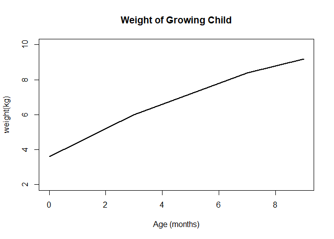
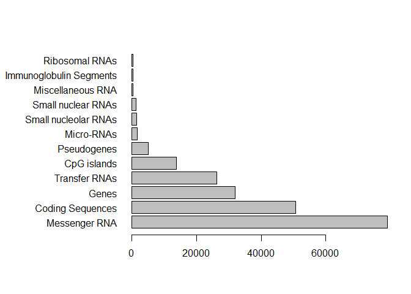
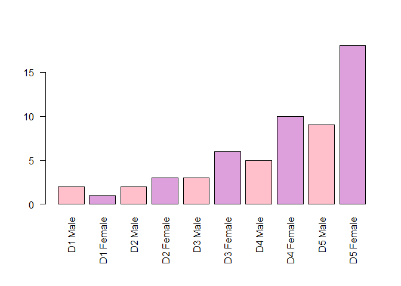
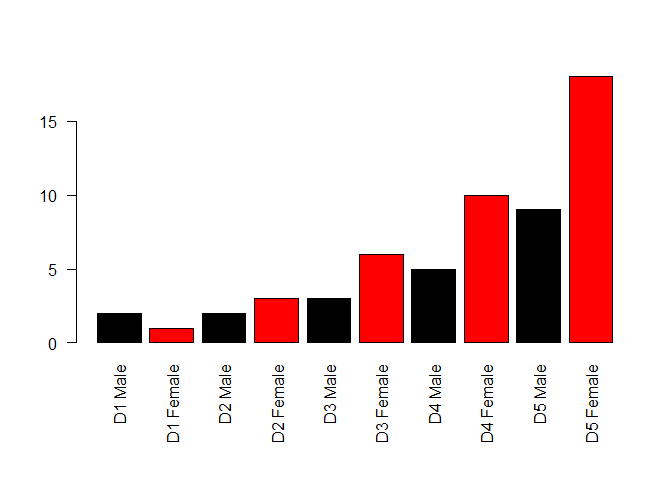
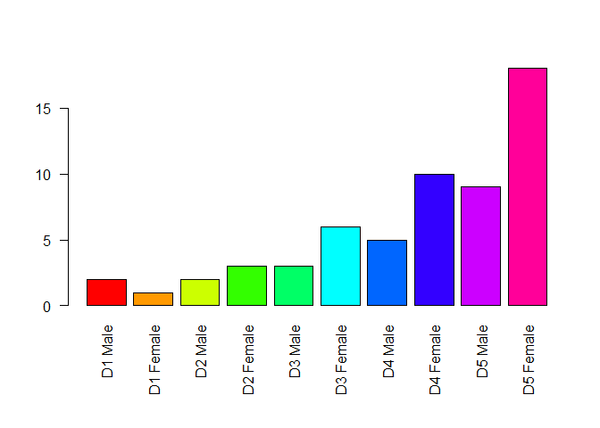

Crop Analysis Q3 2013
================
John Smith
May 3rd, 2014

``` r
# Class 5 R graphics

#2A. Line plot
weight <- read.table("bimm143_05_rstats/weight_chart.txt", header=TRUE)

plot(weight$Age, weight$Weight, xlab="Age (months)", ylab="weight(kg)", 
     main="Weight of Growing Child","l", 
     pch=15, cex=1.5, 
     lwd=2, ylim=c(2,10))
```

<!-- -->

``` r
#2B
features <- read.table("bimm143_05_rstats/feature_counts.txt", sep="\t",header=TRUE)
features
```

    ##                    Feature Count
    ## 1            Messenger RNA 79049
    ## 2         Coding Sequences 50770
    ## 3                    Genes 32029
    ## 4            Transfer RNAs 26248
    ## 5              CpG islands 13840
    ## 6              Pseudogenes  5195
    ## 7               Micro-RNAs  1638
    ## 8     Small nucleolar RNAs  1602
    ## 9       Small nuclear RNAs  1431
    ## 10       Miscellaneous RNA   491
    ## 11 Immunoglobulin Segments   474
    ## 12          Ribosomal RNAs   341

``` r
par(mar=c(5,11,4,2))
barplot(features$Count, horiz=TRUE, names.arg = features$Feature,las=1)
```

<!-- -->

``` r
#3A
gender <- read.delim("bimm143_05_rstats/male_female_counts.txt", header=TRUE)
gender
```

    ##       Sample Count
    ## 1    D1 Male     2
    ## 2  D1 Female     1
    ## 3    D2 Male     2
    ## 4  D2 Female     3
    ## 5    D3 Male     3
    ## 6  D3 Female     6
    ## 7    D4 Male     5
    ## 8  D4 Female    10
    ## 9    D5 Male     9
    ## 10 D5 Female    18

``` r
par(mar=c(7,4,4,2))
barplot(gender$Count, names.arg=gender$Sample, las=2, col=c("pink","plum"))
```

<!-- -->

``` r
barplot(gender$Count, names.arg=gender$Sample, las=2, col=c(1,2))
```

<!-- -->

``` r
barplot(gender$Count, names.arg=gender$Sample, las=2, col=(rainbow(10)))
```

<!-- -->
