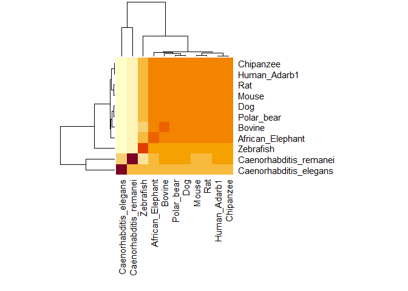

Gene Project
================

``` r
library(bio3d)
```

``` r
adarb1 <- read.fasta("muscle alignment")
```

``` r
seqid.adarb1 <- seqidentity(adarb1)
seqid.adarb1
```

    ##                        Caenorhabditis_elegans Caenorhabditis_remanei
    ## Caenorhabditis_elegans                  1.000                  0.277
    ## Caenorhabditis_remanei                  0.277                  1.000
    ## Zebrafish                               0.199                  0.211
    ## Bovine                                  0.253                  0.455
    ## Dog                                     0.255                  0.451
    ## Polar_bear                              0.253                  0.441
    ## African_Elephant                        0.241                  0.437
    ## Human_Adarb1                            0.252                  0.438
    ## Chipanzee                               0.252                  0.438
    ## Mouse                                   0.246                  0.433
    ## Rat                                     0.246                  0.437
    ##                        Zebrafish Bovine   Dog Polar_bear African_Elephant
    ## Caenorhabditis_elegans     0.199  0.253 0.255      0.253            0.241
    ## Caenorhabditis_remanei     0.211  0.455 0.451      0.441            0.437
    ## Zebrafish                  1.000  0.645 0.700      0.700            0.718
    ## Bovine                     0.645  1.000 0.954      0.943            0.922
    ## Dog                        0.700  0.954 1.000      0.986            0.927
    ## Polar_bear                 0.700  0.943 0.986      1.000            0.922
    ## African_Elephant           0.718  0.922 0.927      0.922            1.000
    ## Human_Adarb1               0.718  0.929 0.936      0.929            0.937
    ## Chipanzee                  0.718  0.930 0.937      0.930            0.935
    ## Mouse                      0.704  0.904 0.914      0.909            0.903
    ## Rat                        0.709  0.906 0.914      0.909            0.904
    ##                        Human_Adarb1 Chipanzee Mouse   Rat
    ## Caenorhabditis_elegans        0.252     0.252 0.246 0.246
    ## Caenorhabditis_remanei        0.438     0.438 0.433 0.437
    ## Zebrafish                     0.718     0.718 0.704 0.709
    ## Bovine                        0.929     0.930 0.904 0.906
    ## Dog                           0.936     0.937 0.914 0.914
    ## Polar_bear                    0.929     0.930 0.909 0.909
    ## African_Elephant              0.937     0.935 0.903 0.904
    ## Human_Adarb1                  1.000     0.999 0.941 0.942
    ## Chipanzee                     0.999     1.000 0.942 0.944
    ## Mouse                         0.941     0.942 1.000 0.990
    ## Rat                           0.942     0.944 0.990 1.000

``` r
rowSums(seqid.adarb1)
```

    ## Caenorhabditis_elegans Caenorhabditis_remanei              Zebrafish 
    ##                  3.474                  5.018                  7.022 
    ##                 Bovine                    Dog             Polar_bear 
    ##                  8.841                  8.974                  8.922 
    ##       African_Elephant           Human_Adarb1              Chipanzee 
    ##                  8.846                  9.021                  9.025 
    ##                  Mouse                    Rat 
    ##                  8.886                  8.901

``` r
heatmap(seqid.adarb1, margins=c(12,12))
```

<!-- -->

``` r
adarb.con <- consensus(adarb1)
```

``` r
adarbblast <- blast.pdb(adarb.con$seq)
```

    ##  Searching ... please wait (updates every 5 seconds) RID = FDFV3H2B01R 
    ##  .
    ##  Reporting 49 hits

``` r
blast.pdb(adarb.con$seq)
```

    ##  Searching ... please wait (updates every 5 seconds) RID = FDFVB7TK01R 
    ##  .
    ##  Reporting 49 hits

    ## $hit.tbl
    ##         queryid subjectids identity alignmentlength mismatches gapopens
    ## 1  Query_135855     1ZY7_A   92.804             403          2       22
    ## 2  Query_135855     5ED1_A   92.556             403          3       22
    ## 3  Query_135855     6D06_A   92.556             403          3       22
    ## 4  Query_135855     2L3J_A   89.912             228          7        9
    ## 5  Query_135855     2L3C_A   97.297              74          0        2
    ## 6  Query_135855     2L3C_A   60.000              60         23        1
    ## 7  Query_135855     2B7T_A   97.260              73          0        2
    ## 8  Query_135855     2B7T_A   60.000              60         23        1
    ## 9  Query_135855     2B7V_A   95.775              71          0        2
    ## 10 Query_135855     2B7V_A   58.730              63         25        1
    ## 11 Query_135855     5DV7_C   44.221             199         77        7
    ## 12 Query_135855     2DMY_A   51.064              94         42        3
    ## 13 Query_135855     2DMY_A   52.542              59         27        1
    ## 14 Query_135855     2LJH_A   53.488              86         38        2
    ## 15 Query_135855     2LJH_A   52.381              63         29        1
    ## 16 Query_135855     2L33_A   67.347              49         15        1
    ## 17 Query_135855     2L33_A   55.556              45         19        1
    ## 18 Query_135855     3P1X_A   63.265              49         17        1
    ## 19 Query_135855     3P1X_A   51.111              45         21        1
    ## 20 Query_135855     5ZAK_B   33.333             192        102        8
    ## 21 Query_135855     5N8L_A   33.333             192        102        8
    ## 22 Query_135855     2N3F_A   39.062              64         36        2
    ## 23 Query_135855     2N3F_A   40.000              50         28        1
    ## 24 Query_135855     6HTU_A   25.263             190         91        4
    ## 25 Query_135855     6HTU_A   44.186              43         24        0
    ## 26 Query_135855     6HTU_A   36.170              47         29        1
    ## 27 Query_135855     1UHZ_A   48.837              43         22        0
    ## 28 Query_135855     1UHZ_A   44.444              45         24        1
    ## 29 Query_135855     2CPN_A   43.243              74         34        5
    ## 30 Query_135855     2CPN_A   41.304              46         26        1
    ## 31 Query_135855     1X47_A   34.831              89         45        5
    ## 32 Query_135855     2MDR_A   39.583              48         28        1
    ## 33 Query_135855     1EKZ_A   33.333              66         35        3
    ## 34 Query_135855     1EKZ_A   41.860              43         25        0
    ## 35 Query_135855     2NA2_A   40.000              50         28        2
    ## 36 Query_135855     1STU_A   36.170              47         29        1
    ## 37 Query_135855     1STU_A   41.860              43         25        0
    ## 38 Query_135855     3ADL_A   42.029              69         32        5
    ## 39 Query_135855     3ADL_A   41.304              46         26        1
    ## 40 Query_135855     1DI2_A   40.816              49         28        1
    ## 41 Query_135855     2YT4_A   32.609              92         49        5
    ## 42 Query_135855     2DIX_A   34.848              66         38        1
    ## 43 Query_135855     2DIX_A   41.667              36         21        0
    ## 44 Query_135855     3MUQ_A   30.508              59         40        1
    ## 45 Query_135855     3C4T_A   31.579              76         49        3
    ## 46 Query_135855     2ZYI_A   30.909              55         37        1
    ## 47 Query_135855     2ZYS_A   30.909              55         37        1
    ## 48 Query_135855     2ZYH_A   30.909              55         37        1
    ## 49 Query_135855     2ZYR_A   30.909              55         37        1
    ##    q.start q.end s.start s.end    evalue bitscore positives  mlog.evalue
    ## 1      268   643       1   403  0.00e+00    681.0     93.30 709.19620864
    ## 2      268   643       1   403  0.00e+00    681.0     93.30 709.19620864
    ## 3      268   643       1   403  0.00e+00    679.0     93.05 709.19620864
    ## 4       59   270       1   228 1.90e-127    376.0     91.67 291.78645292
    ## 5       59   130       1    74  3.81e-39    139.0     97.30  88.46318944
    ## 6      206   264       7    66  8.34e-14     67.8     73.33  30.11512809
    ## 7       59   129       1    73  2.02e-38    137.0     97.26  86.79513602
    ## 8      206   264       7    66  6.94e-14     67.8     73.33  30.29888953
    ## 9      203   270       1    71  3.34e-36    130.0     95.77  81.68709254
    ## 10      61   122       1    63  3.85e-14     68.6     71.43  30.88811815
    ## 11      61   251     397   569  7.97e-33    135.0     55.78  73.90962358
    ## 12      45   137       2    92  5.61e-22     91.7     71.28  48.93232133
    ## 13     207   264      20    78  5.57e-10     57.4     64.41  21.30845588
    ## 14      48   132      22   106  3.91e-19     84.3     70.93  42.38557939
    ## 15     203   264      34    96  1.45e-10     59.7     66.67  22.65428737
    ## 16     205   252      16    64  8.91e-12     62.4     77.55  25.44384687
    ## 17      64   107      17    61  1.02e-07     50.8     75.56  16.09829302
    ## 18     205   252       6    54  5.19e-10     57.0     73.47  21.37911723
    ## 19      64   107       7    51  4.55e-06     45.8     71.11  12.30038333
    ## 20      80   264      50   222  7.11e-04     43.1     43.23   7.24883813
    ## 21      80   264      38   210  7.71e-04     42.4     43.23   7.16782218
    ## 22      64   124      84   147  2.00e-03     40.0     56.25   6.21460810
    ## 23      79   126      23    72  4.70e+00     30.0     52.00  -1.54756251
    ## 24      83   266      29   173  3.00e-03     40.0     35.26   5.80914299
    ## 25      80   122     129   171  1.80e+00     31.6     55.81  -0.58778666
    ## 26     219   264      22    68  1.90e+00     31.6     59.57  -0.64185389
    ## 27      80   122      28    70  9.00e-03     37.0     60.47   4.71053070
    ## 28     221   264      26    70  6.60e-02     34.3     57.78   2.71810054
    ## 29     198   264       8    80  1.90e-02     35.8     52.70   3.96331630
    ## 30      78   122      35    80  2.80e-01     32.7     58.70   1.27296568
    ## 31     203   281      13    98  3.00e-02     35.4     50.56   3.50655790
    ## 32      80   126      58   105  6.50e-02     35.0     56.25   2.73336801
    ## 33     206   264       7    70  6.80e-02     33.9     54.55   2.68824757
    ## 34      80   122      28    70  1.60e-01     32.7     53.49   1.83258146
    ## 35      81   129      32    80  7.40e-02     33.9     58.00   2.60369019
    ## 36     219   264      16    62  8.20e-02     33.5     55.32   2.50103603
    ## 37      80   122      20    62  1.00e-01     33.1     53.49   2.30258509
    ## 38     203   264      12    79  1.50e-01     33.1     53.62   1.89711998
    ## 39      78   122      34    79  2.90e-01     32.3     58.70   1.23787436
    ## 40      78   125      19    67  2.70e-01     32.0     57.14   1.30933332
    ## 41     203   284      19   107  2.80e-01     34.7     51.09   1.27296568
    ## 42     204   264       6    71  9.80e-01     30.8     48.48   0.02020271
    ## 43      87   122      36    71  4.60e+00     28.9     50.00  -1.52605630
    ## 44     375   433     158   215  1.10e+00     32.7     52.54  -0.09531018
    ## 45     190   264     185   258  6.20e+00     30.4     52.63  -1.82454929
    ## 46     338   391     396   450  6.80e+00     30.8     54.55  -1.91692261
    ## 47     338   391     396   450  7.10e+00     30.8     54.55  -1.96009478
    ## 48     338   391     396   450  7.10e+00     30.8     54.55  -1.96009478
    ## 49     338   391     396   450  7.40e+00     30.4     54.55  -2.00148000
    ##    pdb.id    acc
    ## 1  1ZY7_A 1ZY7_A
    ## 2  5ED1_A 5ED1_A
    ## 3  6D06_A 6D06_A
    ## 4  2L3J_A 2L3J_A
    ## 5  2L3C_A 2L3C_A
    ## 6  2L3C_A 2L3C_A
    ## 7  2B7T_A 2B7T_A
    ## 8  2B7T_A 2B7T_A
    ## 9  2B7V_A 2B7V_A
    ## 10 2B7V_A 2B7V_A
    ## 11 5DV7_C 5DV7_C
    ## 12 2DMY_A 2DMY_A
    ## 13 2DMY_A 2DMY_A
    ## 14 2LJH_A 2LJH_A
    ## 15 2LJH_A 2LJH_A
    ## 16 2L33_A 2L33_A
    ## 17 2L33_A 2L33_A
    ## 18 3P1X_A 3P1X_A
    ## 19 3P1X_A 3P1X_A
    ## 20 5ZAK_B 5ZAK_B
    ## 21 5N8L_A 5N8L_A
    ## 22 2N3F_A 2N3F_A
    ## 23 2N3F_A 2N3F_A
    ## 24 6HTU_A 6HTU_A
    ## 25 6HTU_A 6HTU_A
    ## 26 6HTU_A 6HTU_A
    ## 27 1UHZ_A 1UHZ_A
    ## 28 1UHZ_A 1UHZ_A
    ## 29 2CPN_A 2CPN_A
    ## 30 2CPN_A 2CPN_A
    ## 31 1X47_A 1X47_A
    ## 32 2MDR_A 2MDR_A
    ## 33 1EKZ_A 1EKZ_A
    ## 34 1EKZ_A 1EKZ_A
    ## 35 2NA2_A 2NA2_A
    ## 36 1STU_A 1STU_A
    ## 37 1STU_A 1STU_A
    ## 38 3ADL_A 3ADL_A
    ## 39 3ADL_A 3ADL_A
    ## 40 1DI2_A 1DI2_A
    ## 41 2YT4_A 2YT4_A
    ## 42 2DIX_A 2DIX_A
    ## 43 2DIX_A 2DIX_A
    ## 44 3MUQ_A 3MUQ_A
    ## 45 3C4T_A 3C4T_A
    ## 46 2ZYI_A 2ZYI_A
    ## 47 2ZYS_A 2ZYS_A
    ## 48 2ZYH_A 2ZYH_A
    ## 49 2ZYR_A 2ZYR_A
    ## 
    ## $raw
    ##         queryid subjectids identity alignmentlength mismatches gapopens
    ## 1  Query_135855     1ZY7_A   92.804             403          2       22
    ## 2  Query_135855     5ED1_A   92.556             403          3       22
    ## 3  Query_135855     6D06_A   92.556             403          3       22
    ## 4  Query_135855     2L3J_A   89.912             228          7        9
    ## 5  Query_135855     2L3C_A   97.297              74          0        2
    ## 6  Query_135855     2L3C_A   60.000              60         23        1
    ## 7  Query_135855     2B7T_A   97.260              73          0        2
    ## 8  Query_135855     2B7T_A   60.000              60         23        1
    ## 9  Query_135855     2B7V_A   95.775              71          0        2
    ## 10 Query_135855     2B7V_A   58.730              63         25        1
    ## 11 Query_135855     5DV7_C   44.221             199         77        7
    ## 12 Query_135855     2DMY_A   51.064              94         42        3
    ## 13 Query_135855     2DMY_A   52.542              59         27        1
    ## 14 Query_135855     2LJH_A   53.488              86         38        2
    ## 15 Query_135855     2LJH_A   52.381              63         29        1
    ## 16 Query_135855     2L33_A   67.347              49         15        1
    ## 17 Query_135855     2L33_A   55.556              45         19        1
    ## 18 Query_135855     3P1X_A   63.265              49         17        1
    ## 19 Query_135855     3P1X_A   51.111              45         21        1
    ## 20 Query_135855     5ZAK_B   33.333             192        102        8
    ## 21 Query_135855     5N8L_A   33.333             192        102        8
    ## 22 Query_135855     2N3F_A   39.062              64         36        2
    ## 23 Query_135855     2N3F_A   40.000              50         28        1
    ## 24 Query_135855     6HTU_A   25.263             190         91        4
    ## 25 Query_135855     6HTU_A   44.186              43         24        0
    ## 26 Query_135855     6HTU_A   36.170              47         29        1
    ## 27 Query_135855     1UHZ_A   48.837              43         22        0
    ## 28 Query_135855     1UHZ_A   44.444              45         24        1
    ## 29 Query_135855     2CPN_A   43.243              74         34        5
    ## 30 Query_135855     2CPN_A   41.304              46         26        1
    ## 31 Query_135855     1X47_A   34.831              89         45        5
    ## 32 Query_135855     2MDR_A   39.583              48         28        1
    ## 33 Query_135855     1EKZ_A   33.333              66         35        3
    ## 34 Query_135855     1EKZ_A   41.860              43         25        0
    ## 35 Query_135855     2NA2_A   40.000              50         28        2
    ## 36 Query_135855     1STU_A   36.170              47         29        1
    ## 37 Query_135855     1STU_A   41.860              43         25        0
    ## 38 Query_135855     3ADL_A   42.029              69         32        5
    ## 39 Query_135855     3ADL_A   41.304              46         26        1
    ## 40 Query_135855     1DI2_A   40.816              49         28        1
    ## 41 Query_135855     2YT4_A   32.609              92         49        5
    ## 42 Query_135855     2DIX_A   34.848              66         38        1
    ## 43 Query_135855     2DIX_A   41.667              36         21        0
    ## 44 Query_135855     3MUQ_A   30.508              59         40        1
    ## 45 Query_135855     3C4T_A   31.579              76         49        3
    ## 46 Query_135855     2ZYI_A   30.909              55         37        1
    ## 47 Query_135855     2ZYS_A   30.909              55         37        1
    ## 48 Query_135855     2ZYH_A   30.909              55         37        1
    ## 49 Query_135855     2ZYR_A   30.909              55         37        1
    ##    q.start q.end s.start s.end    evalue bitscore positives
    ## 1      268   643       1   403  0.00e+00    681.0     93.30
    ## 2      268   643       1   403  0.00e+00    681.0     93.30
    ## 3      268   643       1   403  0.00e+00    679.0     93.05
    ## 4       59   270       1   228 1.90e-127    376.0     91.67
    ## 5       59   130       1    74  3.81e-39    139.0     97.30
    ## 6      206   264       7    66  8.34e-14     67.8     73.33
    ## 7       59   129       1    73  2.02e-38    137.0     97.26
    ## 8      206   264       7    66  6.94e-14     67.8     73.33
    ## 9      203   270       1    71  3.34e-36    130.0     95.77
    ## 10      61   122       1    63  3.85e-14     68.6     71.43
    ## 11      61   251     397   569  7.97e-33    135.0     55.78
    ## 12      45   137       2    92  5.61e-22     91.7     71.28
    ## 13     207   264      20    78  5.57e-10     57.4     64.41
    ## 14      48   132      22   106  3.91e-19     84.3     70.93
    ## 15     203   264      34    96  1.45e-10     59.7     66.67
    ## 16     205   252      16    64  8.91e-12     62.4     77.55
    ## 17      64   107      17    61  1.02e-07     50.8     75.56
    ## 18     205   252       6    54  5.19e-10     57.0     73.47
    ## 19      64   107       7    51  4.55e-06     45.8     71.11
    ## 20      80   264      50   222  7.11e-04     43.1     43.23
    ## 21      80   264      38   210  7.71e-04     42.4     43.23
    ## 22      64   124      84   147  2.00e-03     40.0     56.25
    ## 23      79   126      23    72  4.70e+00     30.0     52.00
    ## 24      83   266      29   173  3.00e-03     40.0     35.26
    ## 25      80   122     129   171  1.80e+00     31.6     55.81
    ## 26     219   264      22    68  1.90e+00     31.6     59.57
    ## 27      80   122      28    70  9.00e-03     37.0     60.47
    ## 28     221   264      26    70  6.60e-02     34.3     57.78
    ## 29     198   264       8    80  1.90e-02     35.8     52.70
    ## 30      78   122      35    80  2.80e-01     32.7     58.70
    ## 31     203   281      13    98  3.00e-02     35.4     50.56
    ## 32      80   126      58   105  6.50e-02     35.0     56.25
    ## 33     206   264       7    70  6.80e-02     33.9     54.55
    ## 34      80   122      28    70  1.60e-01     32.7     53.49
    ## 35      81   129      32    80  7.40e-02     33.9     58.00
    ## 36     219   264      16    62  8.20e-02     33.5     55.32
    ## 37      80   122      20    62  1.00e-01     33.1     53.49
    ## 38     203   264      12    79  1.50e-01     33.1     53.62
    ## 39      78   122      34    79  2.90e-01     32.3     58.70
    ## 40      78   125      19    67  2.70e-01     32.0     57.14
    ## 41     203   284      19   107  2.80e-01     34.7     51.09
    ## 42     204   264       6    71  9.80e-01     30.8     48.48
    ## 43      87   122      36    71  4.60e+00     28.9     50.00
    ## 44     375   433     158   215  1.10e+00     32.7     52.54
    ## 45     190   264     185   258  6.20e+00     30.4     52.63
    ## 46     338   391     396   450  6.80e+00     30.8     54.55
    ## 47     338   391     396   450  7.10e+00     30.8     54.55
    ## 48     338   391     396   450  7.10e+00     30.8     54.55
    ## 49     338   391     396   450  7.40e+00     30.4     54.55
    ## 
    ## $url
    ##                                                                                                                                                        FDFVB7TK01R 
    ## "https://blast.ncbi.nlm.nih.gov/Blast.cgi?CMD=Get&FORMAT_OBJECT=Alignment&ALIGNMENT_VIEW=Tabular&RESULTS_FILE=on&FORMAT_TYPE=CSV&ALIGNMENTS=20000&RID=FDFVB7TK01R" 
    ## 
    ## attr(,"class")
    ## [1] "blast"

``` r
pdb.annotate(adarbblast$hit.tbl$subjectids)
```

    ## Warning in pdb.annotate(adarbblast$hit.tbl$subjectids): ids should be
    ## standard 4 character PDB-IDs: trying first 4 characters...

    ##        structureId chainId experimentalTechnique resolution ligandId
    ## 1ZY7_A        1ZY7       A     X-RAY DIFFRACTION        1.7   IHP,ZN
    ## 5ED1_A        5ED1       A     X-RAY DIFFRACTION       2.77   IHP,ZN
    ## 6D06_A        6D06       A     X-RAY DIFFRACTION       2.55   IHP,ZN
    ## 2L3J_A        2L3J       A          SOLUTION NMR       <NA>     <NA>
    ## 2L3C_A        2L3C       A          SOLUTION NMR       <NA>     <NA>
    ## 2B7T_A        2B7T       A          SOLUTION NMR       <NA>     <NA>
    ## 2B7V_A        2B7V       A          SOLUTION NMR       <NA>     <NA>
    ## 5DV7_C        5DV7       C     X-RAY DIFFRACTION        3.5     <NA>
    ## 2DMY_A        2DMY       A          SOLUTION NMR       <NA>     <NA>
    ## 2LJH_A        2LJH       A          SOLUTION NMR       <NA>     <NA>
    ## 2L33_A        2L33       A          SOLUTION NMR       <NA>     <NA>
    ## 3P1X_A        3P1X       A     X-RAY DIFFRACTION        1.9      MSE
    ## 5ZAK_B        5ZAK       B   ELECTRON MICROSCOPY        4.4     <NA>
    ## 5N8L_A        5N8L       A          SOLUTION NMR       <NA>     <NA>
    ## 2N3F_A        2N3F       A          SOLUTION NMR       <NA>     <NA>
    ## 6HTU_A        6HTU       A     X-RAY DIFFRACTION       2.89     <NA>
    ## 1UHZ_A        1UHZ       A          SOLUTION NMR       <NA>     <NA>
    ## 2CPN_A        2CPN       A          SOLUTION NMR       <NA>     <NA>
    ## 1X47_A        1X47       A          SOLUTION NMR       <NA>     <NA>
    ## 2MDR_A        2MDR       A          SOLUTION NMR       <NA>     <NA>
    ## 1EKZ_A        1EKZ       A          SOLUTION NMR       <NA>     <NA>
    ## 2NA2_A        2NA2       A          SOLUTION NMR       <NA>     <NA>
    ## 1STU_A        1STU       A          SOLUTION NMR       <NA>     <NA>
    ## 3ADL_A        3ADL       A     X-RAY DIFFRACTION        2.2     <NA>
    ## 1DI2_A        1DI2       A     X-RAY DIFFRACTION        1.9     <NA>
    ## 2YT4_A        2YT4       A     X-RAY DIFFRACTION        2.6     <NA>
    ## 2DIX_A        2DIX       A          SOLUTION NMR       <NA>     <NA>
    ## 3MUQ_A        3MUQ       A     X-RAY DIFFRACTION       2.05      MSE
    ## 3C4T_A        3C4T       A     X-RAY DIFFRACTION        2.8   CD,OCS
    ## 2ZYI_A        2ZYI       A     X-RAY DIFFRACTION        2.3   CA,STE
    ## 2ZYS_A        2ZYS       A     X-RAY DIFFRACTION        3.1   CL,PG4
    ## 2ZYH_A        2ZYH       A     X-RAY DIFFRACTION       1.83   CA,R16
    ## 2ZYR_A        2ZYR       A     X-RAY DIFFRACTION       1.77   1PE,MG
    ##                                ligandName                  source
    ## 1ZY7_A INOSITOL HEXAKISPHOSPHATE,ZINC ION            Homo sapiens
    ## 5ED1_A INOSITOL HEXAKISPHOSPHATE,ZINC ION            Homo sapiens
    ## 6D06_A INOSITOL HEXAKISPHOSPHATE,ZINC ION            Homo sapiens
    ## 2L3J_A                               <NA>       Rattus norvegicus
    ## 2L3C_A                               <NA>       Rattus norvegicus
    ## 2B7T_A                               <NA>       Rattus norvegicus
    ## 2B7V_A                               <NA>       Rattus norvegicus
    ## 5DV7_C                               <NA>            Mus musculus
    ## 2DMY_A                               <NA>            Homo sapiens
    ## 2LJH_A                               <NA> Drosophila melanogaster
    ## 2L33_A                               <NA>            Homo sapiens
    ## 3P1X_A                   SELENOMETHIONINE            Homo sapiens
    ## 5ZAK_B                               <NA>            Homo sapiens
    ## 5N8L_A                               <NA>            Homo sapiens
    ## 2N3F_A                               <NA>    Arabidopsis thaliana
    ## 6HTU_A                               <NA>            Homo sapiens
    ## 1UHZ_A                               <NA>            Mus musculus
    ## 2CPN_A                               <NA>            Homo sapiens
    ## 1X47_A                               <NA>            Homo sapiens
    ## 2MDR_A                               <NA>            Homo sapiens
    ## 1EKZ_A                               <NA> Drosophila melanogaster
    ## 2NA2_A                               <NA>            Homo sapiens
    ## 1STU_A                               <NA> Drosophila melanogaster
    ## 3ADL_A                               <NA>            Homo sapiens
    ## 1DI2_A                               <NA>          Xenopus laevis
    ## 2YT4_A                               <NA>            Homo sapiens
    ## 2DIX_A                               <NA>            Homo sapiens
    ## 3MUQ_A                   SELENOMETHIONINE Vibrio parahaemolyticus
    ## 3C4T_A  CADMIUM ION,CYSTEINESULFONIC ACID            Mus musculus
    ## 2ZYI_A           CALCIUM ION,STEARIC ACID  Archaeoglobus fulgidus
    ## 2ZYS_A  CHLORIDE ION,TETRAETHYLENE GLYCOL  Archaeoglobus fulgidus
    ## 2ZYH_A             CALCIUM ION,HEXADECANE  Archaeoglobus fulgidus
    ## 2ZYR_A PENTAETHYLENE GLYCOL,MAGNESIUM ION  Archaeoglobus fulgidus
    ##                                                                           scopDomain
    ## 1ZY7_A                                                                          <NA>
    ## 5ED1_A                                                                          <NA>
    ## 6D06_A                                                                          <NA>
    ## 2L3J_A                                                                          <NA>
    ## 2L3C_A                                                                          <NA>
    ## 2B7T_A                                                      dsRNA-specific editase 1
    ## 2B7V_A                                                      dsRNA-specific editase 1
    ## 5DV7_C                                                                          <NA>
    ## 2DMY_A                                     Spermatid perinuclear RNA-binding protein
    ## 2LJH_A                                                                          <NA>
    ## 2L33_A                                                                          <NA>
    ## 3P1X_A                                                                          <NA>
    ## 5ZAK_B                                                                          <NA>
    ## 5N8L_A                                                                          <NA>
    ## 2N3F_A                                                                          <NA>
    ## 6HTU_A                                                                          <NA>
    ## 1UHZ_A                                                             staufen homolog 2
    ## 2CPN_A                                                     TAR RNA-binding protein 2
    ## 1X47_A                                                                 Dgcr8 protein
    ## 2MDR_A                                                                          <NA>
    ## 1EKZ_A                                                           Staufen, domain III
    ## 2NA2_A                                                                          <NA>
    ## 1STU_A                                                           Staufen, domain III
    ## 3ADL_A                                                                          <NA>
    ## 1DI2_A                           Double-stranded RNA-binding protein A, second dsRBD
    ## 2YT4_A                                                                          <NA>
    ## 2DIX_A Interferon-inducible double stranded RNA-dependent protein kinase activator A
    ## 3MUQ_A                                                                          <NA>
    ## 3C4T_A                                                                          <NA>
    ## 2ZYI_A                                                                          <NA>
    ## 2ZYS_A                                                                          <NA>
    ## 2ZYH_A                                                                          <NA>
    ## 2ZYR_A                                                                          <NA>
    ##                               classification
    ## 1ZY7_A                             HYDROLASE
    ## 5ED1_A                         HYDROLASE/RNA
    ## 6D06_A                         HYDROLASE/RNA
    ## 2L3J_A                         Hydrolase/RNA
    ## 2L3C_A                         Hydrolase/RNA
    ## 2B7T_A                             HYDROLASE
    ## 2B7V_A                             HYDROLASE
    ## 5DV7_C                   RNA BINDING PROTEIN
    ## 2DMY_A                   RNA BINDING PROTEIN
    ## 2LJH_A                             HYDROLASE
    ## 2L33_A               Transcription regulator
    ## 3P1X_A               Transcription regulator
    ## 5ZAK_B             HYDROLASE/PROTEIN BINDING
    ## 5N8L_A                   RNA BINDING PROTEIN
    ## 2N3F_A                   RNA BINDING PROTEIN
    ## 6HTU_A                   RNA BINDING PROTEIN
    ## 1UHZ_A                   RNA BINDING PROTEIN
    ## 2CPN_A                       GENE REGULATION
    ## 1X47_A                   RNA BINDING PROTEIN
    ## 2MDR_A                             HYDROLASE
    ## 1EKZ_A                        cell cycle/RNA
    ## 2NA2_A   NUCLEAR PROTEIN/RNA BINDING PROTEIN
    ## 1STU_A    DOUBLE STRANDED RNA BINDING DOMAIN
    ## 3ADL_A                   GENE REGULATION/RNA
    ## 1DI2_A               RNA BINDING PROTEIN/RNA
    ## 2YT4_A                   RNA BINDING PROTEIN
    ## 2DIX_A                   RNA BINDING PROTEIN
    ## 3MUQ_A structural genomics, unknown function
    ## 3C4T_A                             HYDROLASE
    ## 2ZYI_A                             HYDROLASE
    ## 2ZYS_A                             HYDROLASE
    ## 2ZYH_A                             HYDROLASE
    ## 2ZYR_A                             HYDROLASE
    ##                                                                             compound
    ## 1ZY7_A                          RNA-specific adenosine deaminase B1, isoform DRADA2a
    ## 5ED1_A                                        Double-stranded RNA-specific editase 1
    ## 6D06_A                                        Double-stranded RNA-specific editase 1
    ## 2L3J_A                                        Double-stranded RNA-specific editase 1
    ## 2L3C_A                                        Double-stranded RNA-specific editase 1
    ## 2B7T_A                                        Double-stranded RNA-specific editase 1
    ## 2B7V_A                                        Double-stranded RNA-specific editase 1
    ## 5DV7_C                                         Interleukin enhancer-binding factor 3
    ## 2DMY_A                                     Spermatid perinuclear RNA-binding protein
    ## 2LJH_A                                     Double-stranded RNA-specific editase Adar
    ## 2L33_A                                         Interleukin enhancer-binding factor 3
    ## 3P1X_A                                         Interleukin enhancer-binding factor 3
    ## 5ZAK_B                                           RISC-loading complex subunit TARBP2
    ## 5N8L_A                                           RISC-loading complex subunit TARBP2
    ## 2N3F_A                                         Double-stranded RNA-binding protein 4
    ## 6HTU_A                         Double-stranded RNA-binding protein Staufen homolog 1
    ## 1UHZ_A                                       staufen (RNA binding protein) homolog 2
    ## 2CPN_A                                                     TAR RNA-binding protein 2
    ## 1X47_A                                                                 DGCR8 protein
    ## 2MDR_A                              Double-stranded RNA-specific adenosine deaminase
    ## 1EKZ_A                                             MATERNAL EFFECT PROTEIN (STAUFEN)
    ## 2NA2_A                                                                Ribonuclease 3
    ## 1STU_A                                               MATERNAL EFFECT PROTEIN STAUFEN
    ## 3ADL_A                                           RISC-loading complex subunit TARBP2
    ## 1DI2_A                                         DOUBLE STRANDED RNA BINDING PROTEIN A
    ## 2YT4_A                                                                 Protein DGCR8
    ## 2DIX_A Interferon-inducible double stranded RNA-dependent protein kinase activator A
    ## 3MUQ_A                                             uncharacterized conserved protein
    ## 3C4T_A                                                        Endoribonuclease Dicer
    ## 2ZYI_A                                                              Lipase, putative
    ## 2ZYS_A                                                              Lipase, putative
    ## 2ZYH_A                                                              Lipase, putative
    ## 2ZYR_A                                                              Lipase, putative
    ##                                                                                                                                                         title
    ## 1ZY7_A                                                                     Inositol hexakisphosphate is bound in the ADAR2 core and required for RNA editing.
    ## 5ED1_A                                                Structures of human ADAR2 bound to dsRNA reveal base-flipping mechanism and basis for site selectivity.
    ## 6D06_A                                                                                                         A Bump-Hole Approach for Directed RNA Editing.
    ## 2L3J_A                                         The Solution Structure of the ADAR2 dsRBM-RNA Complex Reveals a Sequence-Specific Readout of the Minor Groove.
    ## 2L3C_A                                         The Solution Structure of the ADAR2 dsRBM-RNA Complex Reveals a Sequence-Specific Readout of the Minor Groove.
    ## 2B7T_A                                                                        Structure and specific RNA binding of ADAR2 double-stranded RNA binding motifs.
    ## 2B7V_A                                                                        Structure and specific RNA binding of ADAR2 double-stranded RNA binding motifs.
    ## 5DV7_C                                                                Nuclear factor 90 uses an ADAR2-like binding mode to recognize specific bases in dsRNA.
    ## 2DMY_A                                                                            Solution structure of DSRM domain in Spermatid perinuclear RNA-bind protein
    ## 2LJH_A                                                        Solution structure of the N-terminal dsRBD of Drosophila ADAR and interaction studies with RNA.
    ## 2L33_A                                                                                                Northeast Structural Genomics Consortium Target HR4527E
    ## 3P1X_A Crystal structure of DRBM 2 domain of Interleukin enhancer-binding factor 3 from Homo sapiens, Northeast Structural Genomics Consortium Target HR4527E
    ## 5ZAK_B                                                                         Cryo-EM Structure of Human Dicer and Its Complexes with a Pre-miRNA Substrate.
    ## 5N8L_A                                                                     Structural basis of siRNA recognition by TRBP double-stranded RNA binding domains.
    ## 2N3F_A                                                                       DRB4 dsRBD1 drives dsRNA recognition in Arabidopsis thaliana tasi/siRNA pathway.
    ## 6HTU_A                                            The crystal structure of Staufen1 in complex with a physiological RNA sheds light on substrate selectivity.
    ## 1UHZ_A                                                                                        Solution structure of dsRNA binding domain in Staufen homolog 2
    ## 2CPN_A                                                                                    Solution structure of the second dsRBD of TAR RNA-binding protein 2
    ## 1X47_A                                                                                                     Solution structure of DSRM domain in DGCR8 protein
    ## 2MDR_A  A bimodular nuclear localization signal assembled via an extended double-stranded RNA-binding domain acts as an RNA-sensing signal for transportin 1.
    ## 1EKZ_A                                                                                       RNA recognition by a Staufen double-stranded RNA-binding domain.
    ## 2NA2_A                                                                                            Towards understanding Drosha dsRBDs role in Microprocessing
    ## 1STU_A    NMR solution structure of a dsRNA binding domain from Drosophila staufen protein reveals homology to the N-terminal domain of ribosomal protein S5.
    ## 3ADL_A                                                        Structure of arabidopsis HYPONASTIC LEAVES1 and its molecular implications for miRNA processing
    ## 1DI2_A                                 Molecular basis of double-stranded RNA-protein interactions: structure of a dsRNA-binding domain complexed with dsRNA.
    ## 2YT4_A                                                                                                                  Crystal structure of human DGCR8 core
    ## 2DIX_A                                                    Solution structure of the DSRM domain of Protein activator of the interferon-induced protein kinase
    ## 3MUQ_A                                            The crystal structure of a conserved functionally unknown protein from Vibrio parahaemolyticus RIMD 2210633
    ## 3C4T_A                       Structural and biochemical insights into the dicing mechanism of mouse Dicer: A conserved lysine is critical for dsRNA cleavage.
    ## 2ZYI_A Structure of the alkalohyperthermophilic Archaeoglobus fulgidus lipase contains a unique C-terminal domain essential for long-chain substrate binding.
    ## 2ZYS_A Structure of the alkalohyperthermophilic Archaeoglobus fulgidus lipase contains a unique C-terminal domain essential for long-chain substrate binding.
    ## 2ZYH_A Structure of the alkalohyperthermophilic Archaeoglobus fulgidus lipase contains a unique C-terminal domain essential for long-chain substrate binding.
    ## 2ZYR_A Structure of the alkalohyperthermophilic Archaeoglobus fulgidus lipase contains a unique C-terminal domain essential for long-chain substrate binding.
    ##                                                                                                                                                                                                                                 citationAuthor
    ## 1ZY7_A                                                                                                                                                    Macbeth, M.R., Schubert, H.L., Vandemark, A.P., Lingam, A.T., Hill, C.P., Bass, B.L.
    ## 5ED1_A                                                                                                                       Matthews, M.M., Thomas, J.M., Zheng, Y., Tran, K., Phelps, K.J., Scott, A.I., Havel, J., Fisher, A.J., Beal, P.A.
    ## 6D06_A                                                                                                                          Monteleone, L.R., Matthews, M.M., Palumbo, C.M., Thomas, J.M., Zheng, Y., Chiang, Y., Fisher, A.J., Beal, P.A.
    ## 2L3J_A                                                                                         Stefl, R., Oberstrass, F.C., Hood, J.L., Jourdan, M., Zimmermann, M., Skrisovska, L., Maris, C., Peng, L., Hofr, C., Emeson, R.B., Allain, F.H.
    ## 2L3C_A                                                                                         Stefl, R., Oberstrass, F.C., Hood, J.L., Jourdan, M., Zimmermann, M., Skrisovska, L., Maris, C., Peng, L., Hofr, C., Emeson, R.B., Allain, F.H.
    ## 2B7T_A                                                                                                                                                                        Stefl, R., Xu, M., Skrisovska, L., Emeson, R.B., Allain, F.H.-T.
    ## 2B7V_A                                                                                                                                                                        Stefl, R., Xu, M., Skrisovska, L., Emeson, R.B., Allain, F.H.-T.
    ## 5DV7_C                                                                                                                                                                                                  Jayachandran, U., Grey, H., Cook, A.G.
    ## 2DMY_A                                                                                                                                           Kadirvel, S., He, F., Muto, Y., Inoue, M., Kigawa, T., Shirouzu, M., Terada, T., Yokoyama, S.
    ## 2LJH_A                                                                                                                                                                                 Barraud, P., Heale, B.S., O'Connell, M.A., Allain, F.H.
    ## 2L33_A                                                                                                                                                               Liu, G., Janjua, H., Xiao, R., Acton, T.B., Everett, J., Montelione, G.T.
    ## 3P1X_A                                                                        Seetharaman, J., Neely, H., Wang, D., Janjua, H., Cunningham, K., Owens, L., Xiao, R., Liu, J., Baran, M.C., Acton, T.B., Montelione, G.T., Tong, L., Hunt, J.F.
    ## 5ZAK_B                                                                                                                                                                  Liu, Z., Wang, J., Cheng, H., Ke, X., Sun, L., Zhang, Q.C., Wang, H.W.
    ## 5N8L_A                                         Masliah, G., Maris, C., Konig, S.L., Yulikov, M., Aeschimann, F., Malinowska, A.L., Mabille, J., Weiler, J., Holla, A., Hunziker, J., Meisner-Kober, N., Schuler, B., Jeschke, G., Allain, F.H.
    ## 2N3F_A                                                                                                                                                                                      Chiliveri, S.C., Aute, R., Rai, U., Deshmukh, M.V.
    ## 6HTU_A                                                                                                                                      Lazzaretti, D., Bandholz-Cajamarca, L., Emmerich, C., Schaaf, K., Basquin, C., Irion, U., Bono, F.
    ## 1UHZ_A He, F., Muto, Y., Obayashi, N., Shirouzu, M., Terada, T., Kigawa, T., Inoue, M., Yabuki, T., Aoki, M., Seki, E., Matsuda, T., Hirota, H., Yoshida, M., Koboyashi, N., Tanaka, A., Osanai, T., Matsuo, Y., Hayashizaki, Y., Yokoyama, S.
    ## 2CPN_A                                                                                                                                                     Nagata, T., Muto, Y., Inoue, M., Kigawa, T., Terada, T., Shirouzu, M., Yokoyama, S.
    ## 1X47_A                                                                                                                                                         He, F., Muto, Y., Inoue, M., Kigawa, T., Shirouzu, M., Terada, T., Yokoyama, S.
    ## 2MDR_A                                                                                                                                                                   Barraud, P., Banerjee, S., Mohamed, W.I., Jantsch, M.F., Allain, F.H.
    ## 1EKZ_A                                                                                                                   Ramos, A., Grunert, S., Adams, J., Micklem, D.R., Proctor, M.R., Freund, S., Bycroft, M., St Johnston, D., Varani, G.
    ## 2NA2_A                                                                                                                                                                                     Showalter, S.A., Sahu, D., Kranick, J.C., Ghosh, D.
    ## 1STU_A                                                                                                                                                                    Bycroft, M., Grunert, S., Murzin, A.G., Proctor, M., St Johnston, D.
    ## 3ADL_A                                                                                                                                                                   Yang, S.W., Chen, H.Y., Yang, J., Machida, S., Chua, N.H., Yuan, Y.A.
    ## 1DI2_A                                                                                                                                                                                                              Ryter, J.M., Schultz, S.C.
    ## 2YT4_A                                                                                                                                                                        Sohn, S.Y., Bae, W.J., Kim, J.J., Yeom, K.H., Kim, V.N., Cho, Y.
    ## 2DIX_A                                                                                                                                                       Dang, W., Muto, Y., Inoue, M., Kigawa, T., Shirouzu, M., Terada, T., Yokoyama, S.
    ## 3MUQ_A                                                                                                                                                                                            Tan, K., Wu, R., Bearden, J., Joachimiak, A.
    ## 3C4T_A                                                                                                                                                                                 Du, Z., Lee, J.K., Tjhen, R., Stroud, R.M., James, T.L.
    ## 2ZYI_A                                                                                                                                    Chen, C.K., Lee, G.C., Ko, T.P., Guo, R.T., Huang, L.M., Liu, H.J., Ho, Y.F., Shaw, J.F., Wang, A.H.
    ## 2ZYS_A                                                                                                                                    Chen, C.K., Lee, G.C., Ko, T.P., Guo, R.T., Huang, L.M., Liu, H.J., Ho, Y.F., Shaw, J.F., Wang, A.H.
    ## 2ZYH_A                                                                                                                                    Chen, C.K., Lee, G.C., Ko, T.P., Guo, R.T., Huang, L.M., Liu, H.J., Ho, Y.F., Shaw, J.F., Wang, A.H.
    ## 2ZYR_A                                                                                                                                    Chen, C.K., Lee, G.C., Ko, T.P., Guo, R.T., Huang, L.M., Liu, H.J., Ho, Y.F., Shaw, J.F., Wang, A.H.
    ##                   journalName publicationYear
    ## 1ZY7_A                Science            2005
    ## 5ED1_A   Nat.Struct.Mol.Biol.            2016
    ## 6D06_A         Cell Chem Biol            2019
    ## 2L3J_A                   Cell            2010
    ## 2L3C_A                   Cell            2010
    ## 2B7T_A              Structure            2006
    ## 2B7V_A              Structure            2006
    ## 5DV7_C     Nucleic Acids Res.            2016
    ## 2DMY_A        To be Published            <NA>
    ## 2LJH_A              Biochimie            2012
    ## 2L33_A        To be Published            <NA>
    ## 3P1X_A        To be Published            <NA>
    ## 5ZAK_B                   Cell            2018
    ## 5N8L_A                EMBO J.            2018
    ## 2N3F_A     Nucleic Acids Res.            2017
    ## 6HTU_A      Life Sci Alliance            2018
    ## 1UHZ_A        To be Published            <NA>
    ## 2CPN_A        To be Published            <NA>
    ## 1X47_A        To be Published            <NA>
    ## 2MDR_A Proc.Natl.Acad.Sci.USA            2014
    ## 1EKZ_A                EMBO J.            2000
    ## 2NA2_A        To be Published            <NA>
    ## 1STU_A                EMBO J.            1995
    ## 3ADL_A              Structure            2010
    ## 1DI2_A                EMBO J.            1998
    ## 2YT4_A   Nat.Struct.Mol.Biol.            2007
    ## 2DIX_A        To be published            <NA>
    ## 3MUQ_A        To be Published            <NA>
    ## 3C4T_A Proc.Natl.Acad.Sci.Usa            2008
    ## 2ZYI_A            J.Mol.Biol.            2009
    ## 2ZYS_A            J.Mol.Biol.            2009
    ## 2ZYH_A            J.Mol.Biol.            2009
    ## 2ZYR_A            J.Mol.Biol.            2009
    ##                                                                                                                                                     structureTitle
    ## 1ZY7_A                      Crystal structure of the catalytic domain of an adenosine deaminase that acts on RNA (hADAR2) bound to inositol hexakisphosphate (IHP)
    ## 5ED1_A                                 Human Adenosine Deaminase Acting on dsRNA (ADAR2) mutant E488Q bound to dsRNA sequence derived from S. cerevisiae BDF2 gene
    ## 6D06_A                                                           Human ADAR2d E488Y mutant complexed with dsRNA containing an abasic site opposite the edited base
    ## 2L3J_A                                              The solution structure of the ADAR2 dsRBM-RNA complex reveals a sequence-specific read out of the minor groove
    ## 2L3C_A                                                                                                         Solution structure of ADAR2 dsRBM1 bound to LSL RNA
    ## 2B7T_A                                                                                                                                   Structure of ADAR2 dsRBM1
    ## 2B7V_A                                                                                                                                   Structure of ADAR2 dsRBM2
    ## 5DV7_C                                                                                                          Crystal Structure of NF90 tandem dsRBDs with dsRNA
    ## 2DMY_A                                                                                 Solution structure of DSRM domain in Spermatid perinuclear RNA-bind protein
    ## 2LJH_A                                                                                                  NMR structure of Double-stranded RNA-specific editase Adar
    ## 2L33_A Solution NMR Structure of DRBM 2 domain of Interleukin enhancer-binding factor 3 from Homo sapiens, Northeast Structural Genomics Consortium Target HR4527E
    ## 3P1X_A      Crystal structure of DRBM 2 domain of Interleukin enhancer-binding factor 3 from Homo sapiens, Northeast Structural Genomics Consortium Target HR4527E
    ## 5ZAK_B                                                                               Cryo-EM structure of human Dicer and its complexes with a pre-miRNA substrate
    ## 5N8L_A                                                                                   Structure of TRBP dsRBD 1 and 2 in complex with a 19 bp siRNA (Complex B)
    ## 2N3F_A                                                                              Solution structure of both dsRBDs of DRB4 along with linker (viz. DRB4(1-153))
    ## 6HTU_A                                                                                                       Structure of hStau1 dsRBD3-4 in complex with ARF1 RNA
    ## 1UHZ_A                                                                                             Solution structure of dsRNA binding domain in Staufen homolog 2
    ## 2CPN_A                                                                                         Solution structure of the second dsRBD of TAR RNA-binding protein 2
    ## 1X47_A                                                                                                          Solution structure of DSRM domain in DGCR8 protein
    ## 2MDR_A                                              Solution structure of the third double-stranded RNA-binding domain (dsRBD3) of human adenosine-deaminase ADAR1
    ## 1EKZ_A                                                              NMR STRUCTURE OF THE COMPLEX BETWEEN THE THIRD DSRBD FROM DROSOPHILA STAUFEN AND A RNA HAIRPIN
    ## 2NA2_A                                                                                                    DROSHA QUAD MUTANT DOUBLE-STRANDED RNA BINDING COMPETENT
    ## 1STU_A                                                                                                                          DOUBLE STRANDED RNA BINDING DOMAIN
    ## 3ADL_A                                                                                       Structure of TRBP2 and its molecule implications for miRNA processing
    ## 1DI2_A                               CRYSTAL STRUCTURE OF A DSRNA-BINDING DOMAIN COMPLEXED WITH DSRNA: MOLECULAR BASIS OF DOUBLE-STRANDED RNA-PROTEIN INTERACTIONS
    ## 2YT4_A                                                                                                                       Crystal structure of human DGCR8 core
    ## 2DIX_A                                                         Solution structure of the DSRM domain of Protein activator of the interferon-induced protein kinase
    ## 3MUQ_A                                                 The crystal structure of a conserved functionally unknown protein from Vibrio parahaemolyticus RIMD 2210633
    ## 3C4T_A                                                                                             Structure of RNaseIIIb and dsRNA binding domains of mouse Dicer
    ## 2ZYI_A                                                                                                     A. Fulgidus lipase with fatty acid fragment and calcium
    ## 2ZYS_A                                                                                                    A. Fulgidus lipase with fatty acid fragment and chloride
    ## 2ZYH_A                                                                                          mutant A. Fulgidus lipase S136A complexed with fatty acid fragment
    ## 2ZYR_A                                                                                                   A. Fulgidus lipase with fatty acid fragment and magnesium
    ##        depositionDate structureMolecularWeight macromoleculeType entityId
    ## 1ZY7_A     2005-06-09                 91557.72           Protein        1
    ## 5ED1_A     2015-10-20                106174.54       Protein#RNA        1
    ## 6D06_A     2018-04-10                106171.59       Protein#RNA        1
    ## 2L3J_A     2010-09-14                 48236.26       Protein#RNA        1
    ## 2L3C_A     2010-09-12                 18899.87       Protein#RNA        1
    ## 2B7T_A     2005-10-05                  7922.33           Protein        1
    ## 2B7V_A     2005-10-05                  7703.83           Protein        1
    ## 5DV7_C     2015-09-21                 87524.56       Protein#RNA        3
    ## 2DMY_A     2006-04-24                 10120.54           Protein        1
    ## 2LJH_A     2011-09-13                 12564.59           Protein        1
    ## 2L33_A     2010-09-03                 10189.67           Protein        1
    ## 3P1X_A     2010-09-30                 16818.78           Protein        1
    ## 5ZAK_B     2018-02-07                258032.61           Protein        2
    ## 5N8L_A     2017-02-23                 36294.22       Protein#RNA        1
    ## 2N3F_A     2015-05-29                 16618.72           Protein        1
    ## 6HTU_A     2018-10-04                 73387.84       Protein#RNA        3
    ## 1UHZ_A     2003-07-14                   9504.8           Protein        1
    ## 2CPN_A     2005-05-19                  9488.76           Protein        1
    ## 1X47_A     2005-05-14                 10413.64           Protein        1
    ## 2MDR_A     2013-09-17                 12492.19           Protein        1
    ## 1EKZ_A     2000-03-11                  18076.7       Protein#RNA        2
    ## 2NA2_A     2015-12-17                  8973.34           Protein        1
    ## 1STU_A     1995-05-16                  7570.98           Protein        1
    ## 3ADL_A     2010-01-22                 16345.37       Protein#RNA        1
    ## 1DI2_A     1999-11-28                 28207.65       Protein#RNA        2
    ## 2YT4_A     2007-04-05                 26247.09           Protein        1
    ## 2DIX_A     2006-03-30                  8845.99           Protein        1
    ## 3MUQ_A     2010-05-03                 53501.89           Protein        1
    ## 3C4T_A     2008-01-30                 30933.99           Protein        1
    ## 2ZYI_A     2009-01-22                106609.84           Protein        1
    ## 2ZYS_A     2009-01-29                 53638.54           Protein        1
    ## 2ZYH_A     2009-01-22                106461.77           Protein        1
    ## 2ZYR_A     2009-01-28                108460.95           Protein        1
    ##                                                                                                                                                                                                                                                                                                                                                                                                                                                                                                                                                                                                                                                                                                                            sequence
    ## 1ZY7_A                                                                                                                                                                                                                                                                                                          LHLDQTPSRQPIPSEGLQLHLPQVLADAVSRLVLGKFGDLTDNFSSPHARRKVLAGVVMTTGTDVKDAKVISVSTGTKCINGEYMSDRGLALNDCHAEIISRRSLLRFLYTQLELYLNNKDDQKRSIFQKSERGGFRLKENVQFHLYISTSPCGDARIFSPHEPILEEPADRHPNRKARGQLRTKIESGEGTIPVRSNASIQTWDGVLQGERLLTMSCSDKIARWNVVGIQGSLLSIFVEPIYFSSIILGSLYHGDHLSRAMYQRISNIEDLPPLYTLNKPLLSGISNAEARQPGKAPNFSVNWTVGDSAIEVINATTGKDELGRASRLCKHALYCRWMRVHGKVPSHLLRSKITKPNVYHESKLAAKEYQAAKARLFTAFIKAGLGAWVEKPTEQDQFSLTP
    ## 5ED1_A                                                                                                                                                                                                                                                                                                          LHLDQTPSRQPIPSEGLQLHLPQVLADAVSRLVLGKFGDLTDNFSSPHARRKVLAGVVMTTGTDVKDAKVISVSTGTKCINGEYMSDRGLALNDCHAEIISRRSLLRFLYTQLELYLNNKDDQKRSIFQKSERGGFRLKENVQFHLYISTSPCGDARIFSPHEPILEEPADRHPNRKARGQLRTKIESGQGTIPVRSNASIQTWDGVLQGERLLTMSCSDKIARWNVVGIQGSLLSIFVEPIYFSSIILGSLYHGDHLSRAMYQRISNIEDLPPLYTLNKPLLSGISNAEARQPGKAPNFSVNWTVGDSAIEVINATTGKDELGRASRLCKHALYCRWMRVHGKVPSHLLRSKITKPNVYHESKLAAKEYQAAKARLFTAFIKAGLGAWVEKPTEQDQFSLTP
    ## 6D06_A                                                                                                                                                                                                                                                                                                          LHLDQTPSRQPIPSEGLQLHLPQVLADAVSRLVLGKFGDLTDNFSSPHARRKVLAGVVMTTGTDVKDAKVISVSTGTKCINGEYMSDRGLALNDCHAEIISRRSLLRFLYTQLELYLNNKDDQKRSIFQKSERGGFRLKENVQFHLYISTSPCGDARIFSPHEPILEEPADRHPNRKARGQLRTKIESGYGTIPVRSNASIQTWDGVLQGERLLTMSCSDKIARWNVVGIQGSLLSIFVEPIYFSSIILGSLYHGDHLSRAMYQRISNIEDLPPLYTLNKPLLSGISNAEARQPGKAPNFSVNWTVGDSAIEVINATTGKDELGRASRLCKHALYCRWMRVHGKVPSHLLRSKITKPNVYHESKLAAKEYQAAKARLFTAFIKAGLGAWVEKPTEQDQFSLTP
    ## 2L3J_A                                                                                                                                                                                                                                                                                                                                                                                                                                                                                 PGPVLPKNALMQLNEIKPGLQYMLLSQTGPVHAPLFVMSVEVNGQVFEGSGPTKKKAKLHAAEKALRSFVQFPNASEAHLAMGRTLSVNTDFTSDQADFPDTLFNGFETPDKSEPPFYVGSNGDDSFSSSGDVSLSASPVPASLTQPPLPIPPPFPPPSGKNPVMILNELRPGLKYDFLSESGESHAKSFVMSVVVDGQFFEGSGRNKKLAKARAAQSALATVFNLHLLEHHHHHH
    ## 2L3C_A                                                                                                                                                                                                                                                                                                                                                                                                                                                                                                                                                                                                                                                   PGPVLPKNALMQLNEIKPGLQYMLLSQTGPVHAPLFVMSVEVNGQVFEGSGPTKKKAKLHAAEKALRSFVQFPN
    ## 2B7T_A                                                                                                                                                                                                                                                                                                                                                                                                                                                                                                                                                                                                                                                    PGPVLPKNALMQLNEIKPGLQYMLLSQTGPVHAPLFVMSVEVNGQVFEGSGPTKKKAKLHAAEKALRSFVQFP
    ## 2B7V_A                                                                                                                                                                                                                                                                                                                                                                                                                                                                                                                                                                                                                                                      PSGKNPVMILNELRPGLKYDFLSESGESHAKSFVMSVVVDGQFFEGSGRNKKLAKARAAQSALATVFNLHL
    ## 5DV7_C MRIFVNDDRHVMAKHSSVYPTQEELEAVQNMVSHTERALKAVSDWIDEQEKGNSELSEAENMDTPPDDESKEGAGEQKAEHMTRTLRGVMRVGLVAKGLLLKGDLDLELVLLCKEKPTTALLDKVADNLAIQLTTVTEDKYEILQSVDDAAIVIKNTKEPPLSLTIHLTSPVVREEMEKVLAGETLSVNDPPDVLDRQKCLAALASLRHAKWFQARANGLKSCVIVIRVLRDLCTRVPTWGPLRGWPLELLCEKSIGTANRPMGAGEALRRVLECLASGIVMPDGSGIYDPCEKEATDAIGHLDRQQREDITQSAQHALRLAAFGQLHKVLGMDPLPSKMPKKPKNENPVDYTVQIPPSTTYAITPMKRPMEEDGEEKSPSKKKKKIQKKEEKADPPQAMNALMRLNQLKPGLQYKLISQTGPVHAPIFTMSVEVDGSNFEASGPSKKTAKLHVAVKVLQDMGLPTGAEGRDSSKGEDSAEESDGKPAIVAPPPVVEAVSNPSSVFPSDATTEQGPILTKHGKNPVMELNEKRRGLKYELISETGGSHDKRFVMEVEVDGQKFQGAGSNKKVAKAYAALAALEKLFPDTPLALEANKKKRTPVPVRGGPKFAAKPHNPGFGMGGPMHNEVPPPPNIRGRGRGGNIRGRGRGRGFGGANHGGGYMNAGAGYGSYGYSSNSATAGYSDFFTDCYGYHDFGAS
    ## 2DMY_A                                                                                                                                                                                                                                                                                                                                                                                                                                                                                                                                                                                                                            GSSGSSGRKILDSKAIDLMNALMRLNQIRPGLQYKLLSQSGPVHAPVFTMSVDVDGTTYEASGPSKKTAKLHVAVKVLQAMGYPTGFDADISGPSSG
    ## 2LJH_A                                                                                                                                                                                                                                                                                                                                                                                                                                                                                                                                                                                                           MGSSHHHHHHSSGLVPRGSHMSDPKKKMCKERIPQPKNTVAMLNELRHGLIYKLESQTGPVHAPLFTISVEVDGQKYLGQGRSKKVARIEAAATALRSFIQFKDGAVLSPLKPA
    ## 2L33_A                                                                                                                                                                                                                                                                                                                                                                                                                                                                                                                                                                                                                                  MGHHHHHHSHMLTKHGKNPVMELNEKRRGLKYELISETGGSHDKRFVMEVEVDGQKFQGAGSNKKVAKAYAALAALEKLFPDTPLALDANK
    ## 3P1X_A                                                                                                                                                                                                                                                                                                                                                                                                                                                                                                                                                                                                                                                  ILTKHGKNPVMELNEKRRGLKYELISETGGSHDKRFVMEVEVDGQKFQGAGSNKKVAKAYAALAALEKLFPDTPL
    ## 5ZAK_B                                                                                                                                                                                                                                                                                                                                               MSEEEQGSGTTTGCGLPSIEQMLAANPGKTPISLLQEYGTRIGKTPVYDLLKAEGQAHQPNFTFRVTVGDTSCTGQGPSKKAAKHKAAEVALKHLKGGSMLEPALEDSSSFSPLDSSLPEDIPVFTAAAAATPVPSVVLTRSPPMELQPPVSPQQSECNPVGALQELVVQKGWRLPEYTVTQESGPAHRKEFTMTCRVERFIEIGSGTSKKLAKRNAAAKMLLRVHTVPLDARDGNEVEPDDDHFSIGVGSRLDGLRNRGPGCTWDSLRNSVGEKILSLRSCSLGSLGALGPACCRVLSELSEEQAFHVSYLDIEELSLSGLCQCLVELSTQPATVCHGSATTREAARGEAARRALQYLKIMAGSK
    ## 5N8L_A                                                                                                                                                                                                                                                                                                                                                                                                                                                                                                      GGSLPSIEQMLAANPGKTPISLLQEYGTRIGKTPVYDLLKAEGQAHQPNFTFRVTVGDTSCTGQGPSKKAAKHKAAEVALKHLKGGSMLEPALEDSSSFSPLDSSLPEDIPVFTAAAAATPVPSVVLTRSPPMELQPPVSPQQSECNPVGALQELVVQKGWRLPEYTVTQESGPAHRKEFTMTCRVERFIEIGSGTSKKLAKRNAAAKMLLRVHT
    ## 2N3F_A                                                                                                                                                                                                                                                                                                                                                                                                                                                                                                                                                                    MDHVYKGQLQAYALQHNLELPVYANEREGPPHAPRFRCNVTFCGQTFQSSEFFPTLKSAEHAAAKIAVASLTPQSPEGIDVAYKNLLQEIAQKESSLLPFYATATSGPSHAPTFTSTVEFAGKVFSGEEAKTKKLAEMSAAKVAFMSIKNGNS
    ## 6HTU_A                                                                                                                                                                                                                                                                                                                                                                                                                                                                                                                                       GHMNKSEISQVFEIALKRNLPVNFEVARESGPPHMKNFVTKVSVGEFVGEGEGKSKKISKKNAAIAVLEELKKLPPLPAVERVKPRIKKKTKPIVKPQTSPEYGQGINPISRLAQIQQAKKEKEPEYTLLTERGLPRRREFVMQVKVGNHTAEGTGTNKKVAKRNAAENMLEILGFKVPQRQ
    ## 1UHZ_A                                                                                                                                                                                                                                                                                                                                                                                                                                                                                                                                                                                                                                    GSSGSSGPISRLAQIQQARKEKEPDYILLSERGMPRRREFVMQVKVGNEVATGTGPNKKIAKKNAAEAMLLQLGYKASTSLQDSGPSSG
    ## 2CPN_A                                                                                                                                                                                                                                                                                                                                                                                                                                                                                                                                                                                                                                    GSSGSSGPVSPQQSECNPVGALQELVVQKGWRLPEYTVTQESGPAHRKEFTMTCRVERFIEIGSGTSKKLAKRNAAAKMLLRVSGPSSG
    ## 1X47_A                                                                                                                                                                                                                                                                                                                                                                                                                                                                                                                                                                                                                           GSSGSSGEFVINPNGKSEVCILHEYMQRVLKVRPVYNFFECENPSEPFGASVTIDGVTYGSGTASSKKLAKNKAARATLEILIPDFVKQTSESGPSSG
    ## 2MDR_A                                                                                                                                                                                                                                                                                                                                                                                                                                                                                                                                                                                                            GSSHHHHHHSSGLVPRGSHMMPNKVRKIGELVRYLNTNPVGGLLEYARSHGFAAEFKLVDQSGPPHEPKFVYQAKVGGRWFPAVCAHSKKQGKQEAADAALRVLIGENEKAER
    ## 1EKZ_A                                                                                                                                                                                                                                                                                                                                                                                                                                                                                                                                                                                                                                                 MDEGDKKSPISQVHEIGIKRNMTVHFKVLREEGPAHMKNFITACIVGSIVTEGEGNGKKVSKKRAAEKMLVELQKL
    ## 2NA2_A                                                                                                                                                                                                                                                                                                                                                                                                                                                                                                                                                                                                                                           GPGNDPISQLQQCCLTLRTEGKEPDIPLYKTLQTVGPSHARTYTVAVYFKGERIGCGKGPSKKQAKMGAAMDALEKYNFPQM
    ## 1STU_A                                                                                                                                                                                                                                                                                                                                                                                                                                                                                                                                                                                                                                                         PISQVHEIGIKRNMTVHFKVLREEGPAHMKNFITACIVGSIVTEGEGNGKKVSKKRAAEKMLVELQKL
    ## 3ADL_A                                                                                                                                                                                                                                                                                                                                                                                                                                                                                                                                                                                                                                     HHHHHHSSGLVPRGSHEVGALQELVVQKGWRLPEYTVTQESGPAHRKEFTMTCRVERFIEIGSGTSKKLAKRNAAAKMLLRVHTVPLD
    ## 1DI2_A                                                                                                                                                                                                                                                                                                                                                                                                                                                                                                                                                                                                                                                        MPVGSLQELAVQKGWRLPEYTVAQESGPPHKREFTITCRVETFVETGSGTSKQVAKRVAAEKLLTKFKT
    ## 2YT4_A                                                                                                                                                                                                                                                                                                                                                                                                                                                                                     GSHMSVQDAPTKKEFVINPNGKSEVCILHEYMQRVLKVRPVYNFFECENPSEPFGASVTIDGVTYGSGTASSKKLAKNKAARATLEILIPDFVKQTSEEKPKDSEELEYFNHISIEDSRVYELTSKAGLLSPYQILHECLKRNHGMGDTSIKFEVVPGKNQKSEYVMACGKHTVRGWCKNKRVGKQLASQKILQLLHPHVKNWGSLLRMYGRESSKMVKQETSDKSVIELQQ
    ## 2DIX_A                                                                                                                                                                                                                                                                                                                                                                                                                                                                                                                                                                                                                                         GSSGSSGKTPIQVLHEYGMKTKNIPVYECERSDVQIHVPTFTFRVTVGDITCTGEGTSKKLAKHRAAEAAINILKANASGPSSG
    ## 3MUQ_A                                                                                                                                                                                                                                                                                                                                                                                                                                                                                SNAAEHVRLATTTSTYHSGLLDYLLPQFEKDTGYKVDVIAAGTGKALKMGENGDVDLVMTHAPKAEGTFVEKGYGVLPRKLMYNDFVIVGPKADPAKIKDDESVLDVFKEIANKNATFISRGDDSGTHKKEMGFWAQTKIEPNFGGYRSVGQGMGPTLNMASEMQGYTMSDRGTWLAYQNKLDLEILFQGDEKLFNPYQVILVNPERYPTINYQGAKAFSDWLVNPRGQELINGFRL
    ## 3C4T_A                                                                                                                                                                                                                                                                                                                                                                                                                                                    GPDAEKTLNHLISGFETFEKKINYRFKNKAYLLQAFTHASYHYNTITDCYQRLEFLGDAILDYLITKHLYEDPRQHSPGVLTDLRSALVNNTIFASLAVKYDYHKYFKAVSPELFHVIDDFVKFQLEKNEMQGMDSELRRSEEDEEKEEDIEVPKAMGDIFESLAGAIYMDSGMSLEVVWQVYYPMMQPLIEKFSANVPRSPVRELLEMEPETAKFSPAERTYDGKVRVTVEVVGKGKFKGVGRSYRIAKSAAARRALRSLKANQ
    ## 2ZYI_A                                                                                                                                                                                                                                  MRGLAVLVLLVFAVQVAAAEDFRPVVFVHGLAGSAGQFESQGMRFAANGYPAEYVKTFEYDTISWALVVETDMLFSGLGSEFGLNISQIIDPETLDKILSKSRERLIDETFSRLDRVIDEALAESGADKVDLVGHSMGTFFLVRYVNSSPERAAKVAHLILLDGVWGVDAPEGIPTLAVFGNPKALPALGLPEEKVVYNATNVYFNNMTHVQLCTSPETFAVMFEFINGYKPATTDIVPQDGDYVKVKGKFLAFATNGDVSGWLSIYPIDENGKRLTRLPVKFMRVKGDFEVRLRKGQLYEFQFRKDFSPIIYHYYRAPFVRDDLWARFLVSKPPLDVELLILPERLSPAAKETSGLLLIRYKEMIGEYDEEIGGVDEVYVNGVNVCTERICPIERAVNGLWVFDRGADGKSDLDREVVRYSIMPFMSAADLVVPAEGTISIAVKSRTGGEESFTIPAWSADRHSIIVQFSDYIV
    ## 2ZYS_A                                                                                                                                                                                                                              MRGLAVLVLLVFAVQVAAAEDFRPVVFVHGLAGSAGQFESQGMRFAANGYPAEYVKTFEYDTISWALVVETDMLFSGLGSEFGLNISQIIDPETLDKILSKSRERLIDETFSRLDRVIDEALAESGADKVDLVGHSMGTFFLVRYVNSSPERAAKVAHLILLDGVWGVDAPEGIPTLAVFGNPKALPALGLPEEKVVYNATNVYFNNMTHVQLCTSPETFAVMFEFINGYKPATTDIVPQDGDYVKVKGKFLAFATNGDVSGWLSIYPIDENGKRLTRLPVKFMRVKGDFEVRLRKGQLYEFQFRKDFSPIIYHYYRAPFVRDDLWARFLVSKPPLDVELLILPERLSPAAKETSGLLLIRYKEMIGEYDEEIGGVDEVYVNGVNVCTERICPIERAVNGLWVFDRGADGKSDLDREVVRYSIMPFMSAADLVVPAEGTISIAVKSRTGGEESFTIPAWSADRHSIIVQFSDYIVDKLA
    ## 2ZYH_A                                                                                                                                                                                                                                  MRGLAVLVLLVFAVQVAAAEDFRPVVFVHGLAGSAGQFESQGMRFAANGYPAEYVKTFEYDTISWALVVETDMLFSGLGSEFGLNISQIIDPETLDKILSKSRERLIDETFSRLDRVIDEALAESGADKVDLVGHAMGTFFLVRYVNSSPERAAKVAHLILLDGVWGVDAPEGIPTLAVFGNPKALPALGLPEEKVVYNATNVYFNNMTHVQLCTSPETFAVMFEFINGYKPATTDIVPQDGDYVKVKGKFLAFATNGDVSGWLSIYPIDENGKRLTRLPVKFMRVKGDFEVRLRKGQLYEFQFRKDFSPIIYHYYRAPFVRDDLWARFLVSKPPLDVELLILPERLSPAAKETSGLLLIRYKEMIGEYDEEIGGVDEVYVNGVNVCTERICPIERAVNGLWVFDRGADGKSDLDREVVRYSIMPFMSAADLVVPAEGTISIAVKSRTGGEESFTIPAWSADRHSIIVQFSDYIV
    ## 2ZYR_A                                                                                                                                                                                                                         MRGLAVLVLLVFAVQVAAAEDFRPVVFVHGLAGSAGQFESQGMRFAANGYPAEYVKTFEYDTISWALVVETDMLFSGLGSEFGLNISQIIDPETLDKILSKSRERLIDETFSRLDRVIDEALAESGADKVDLVGHSMGTFFLVRYVNSSPERAAKVAHLILLDGVWGVDAPEGIPTLAVFGNPKALPALGLPEEKVVYNATNVYFNNMTHVQLCTSPETFAVMFEFINGYKPATTDIVPQDGDYVKVKGKFLAFATNGDVSGWLSIYPIDENGKRLTRLPVKFMRVKGDFEVRLRKGQLYEFQFRKDFSPIIYHYYRAPFVRDDLWARFLVSKPPLDVELLILPERLSPAAKETSGLLLIRYKEMIGEYDEEIGGVDEVYVNGVNVCTERICPIERAVNGLWVFDRGADGKSDLDREVVRYSIMPFMSAADLVVPAEGTISIAVKSRTGGEESFTIPAWSADRHSIIVQFSDYIVDKLAAALEH
    ##        chainLength  db_id db_name rObserved rFree spaceGroup
    ## 1ZY7_A         403 P78563 UniProt     0.175 0.206 P 21 21 21
    ## 5ED1_A         403 P78563 UniProt     0.166 0.223 P 21 21 21
    ## 6D06_A         403 P78563 UniProt     0.193 0.255    C 1 2 1
    ## 2L3J_A         236 P51400 UniProt      <NA>  <NA>       <NA>
    ## 2L3C_A          74 P51400 UniProt      <NA>  <NA>       <NA>
    ## 2B7T_A          73 P51400 UniProt      <NA>  <NA>       <NA>
    ## 2B7V_A          71 P51400 UniProt      <NA>  <NA>       <NA>
    ## 5DV7_C         700 Q9Z1X4 UniProt     0.241 0.273   P 31 1 2
    ## 2DMY_A          97 Q96SI9 UniProt      <NA>  <NA>       <NA>
    ## 2LJH_A         114 Q9NII1 UniProt      <NA>  <NA>       <NA>
    ## 2L33_A          91 Q12906 UniProt      <NA>  <NA>       <NA>
    ## 3P1X_A          75 Q12906 UniProt     0.213  0.25    C 1 2 1
    ## 5ZAK_B         366 Q15633 UniProt      <NA>  <NA>        P 1
    ## 5N8L_A         215 Q15633 UniProt      <NA>  <NA>       <NA>
    ## 2N3F_A         153 Q8H1D4 UniProt      <NA>  <NA>       <NA>
    ## 6HTU_A         182 O95793 UniProt     0.218  0.24  P 41 21 2
    ## 1UHZ_A          89 Q8CJ67 UniProt      <NA>  <NA>        P 1
    ## 2CPN_A          89 Q15633 UniProt      <NA>  <NA>       <NA>
    ## 1X47_A          98 Q8WYQ5 UniProt      <NA>  <NA>       <NA>
    ## 2MDR_A         113 P55265 UniProt      <NA>  <NA>       <NA>
    ## 1EKZ_A          76 P25159 UniProt      <NA>  <NA>        P 1
    ## 2NA2_A          82 Q9NRR4 UniProt      <NA>  <NA>       <NA>
    ## 1STU_A          68 P25159 UniProt      <NA>  <NA>        P 1
    ## 3ADL_A          88 Q15633 UniProt     0.263 0.298 I 21 21 21
    ## 1DI2_A          69 Q91836 UniProt     0.231 0.258    C 1 2 1
    ## 2YT4_A         232 Q8WYQ5 UniProt     0.214 0.269    C 1 2 1
    ## 2DIX_A          84 O75569 UniProt      <NA>  <NA>       <NA>
    ## 3MUQ_A         237 Q87PK2 UniProt     0.166 0.207  P 21 21 2
    ## 3C4T_A         265 Q8R418 UniProt     0.236 0.304  P 42 21 2
    ## 2ZYI_A         475 O28511 UniProt      <NA> 0.238 P 21 21 21
    ## 2ZYS_A         479 O28511 UniProt      <NA> 0.252       P 43
    ## 2ZYH_A         475 O28511 UniProt      <NA> 0.223 P 21 21 21
    ## 2ZYR_A         484 O28511 UniProt      <NA> 0.214 P 21 21 21
    ##                                             citation
    ## 1ZY7_A                 Macbeth et al. Science (2005)
    ## 5ED1_A   Matthews et al. Nat.Struct.Mol.Biol. (2016)
    ## 6D06_A       Monteleone et al. Cell Chem Biol (2019)
    ## 2L3J_A                      Stefl et al. Cell (2010)
    ## 2L3C_A                      Stefl et al. Cell (2010)
    ## 2B7T_A                 Stefl et al. Structure (2006)
    ## 2B7V_A                 Stefl et al. Structure (2006)
    ## 5DV7_C Jayachandran et al. Nucleic Acids Res. (2016)
    ## 2DMY_A        Kadirvel et al. To be Published (null)
    ## 2LJH_A               Barraud et al. Biochimie (2012)
    ## 2L33_A             Liu et al. To be Published (null)
    ## 3P1X_A     Seetharaman et al. To be Published (null)
    ## 5ZAK_B                        Liu et al. Cell (2018)
    ## 5N8L_A                 Masliah et al. EMBO J. (2018)
    ## 2N3F_A    Chiliveri et al. Nucleic Acids Res. (2017)
    ## 6HTU_A    Lazzaretti et al. Life Sci Alliance (2018)
    ## 1UHZ_A              He et al. To be Published (null)
    ## 2CPN_A          Nagata et al. To be Published (null)
    ## 1X47_A              He et al. To be Published (null)
    ## 2MDR_A  Barraud et al. Proc.Natl.Acad.Sci.USA (2014)
    ## 1EKZ_A                   Ramos et al. EMBO J. (2000)
    ## 2NA2_A       Showalter et al. To be Published (null)
    ## 1STU_A                 Bycroft et al. EMBO J. (1995)
    ## 3ADL_A                  Yang et al. Structure (2010)
    ## 1DI2_A                   Ryter et al. EMBO J. (1998)
    ## 2YT4_A       Sohn et al. Nat.Struct.Mol.Biol. (2007)
    ## 2DIX_A            Dang et al. To be published (null)
    ## 3MUQ_A             Tan et al. To be Published (null)
    ## 3C4T_A       Du et al. Proc.Natl.Acad.Sci.Usa (2008)
    ## 2ZYI_A                Chen et al. J.Mol.Biol. (2009)
    ## 2ZYS_A                Chen et al. J.Mol.Biol. (2009)
    ## 2ZYH_A                Chen et al. J.Mol.Biol. (2009)
    ## 2ZYR_A                Chen et al. J.Mol.Biol. (2009)

``` r
adarbblast[["hit.tbl"]][["identity"]]
```

    ##  [1] 92.804 92.556 92.556 89.912 97.297 60.000 97.260 60.000 95.775 58.730
    ## [11] 44.221 51.064 52.542 53.488 52.381 67.347 55.556 63.265 51.111 33.333
    ## [21] 33.333 39.062 40.000 25.263 44.186 36.170 48.837 44.444 43.243 41.304
    ## [31] 34.831 39.583 33.333 41.860 40.000 36.170 41.860 42.029 41.304 40.816
    ## [41] 32.609 34.848 41.667 30.508 31.579 30.909 30.909 30.909 30.909

``` r
 adarbblast[["hit.tbl"]][["evalue"]]
```

    ##  [1]  0.00e+00  0.00e+00  0.00e+00 1.90e-127  3.81e-39  8.34e-14  2.02e-38
    ##  [8]  6.94e-14  3.34e-36  3.85e-14  7.97e-33  5.61e-22  5.57e-10  3.91e-19
    ## [15]  1.45e-10  8.91e-12  1.02e-07  5.19e-10  4.55e-06  7.11e-04  7.71e-04
    ## [22]  2.00e-03  4.70e+00  3.00e-03  1.80e+00  1.90e+00  9.00e-03  6.60e-02
    ## [29]  1.90e-02  2.80e-01  3.00e-02  6.50e-02  6.80e-02  1.60e-01  7.40e-02
    ## [36]  8.20e-02  1.00e-01  1.50e-01  2.90e-01  2.70e-01  2.80e-01  9.80e-01
    ## [43]  4.60e+00  1.10e+00  6.20e+00  6.80e+00  7.10e+00  7.10e+00  7.40e+00
